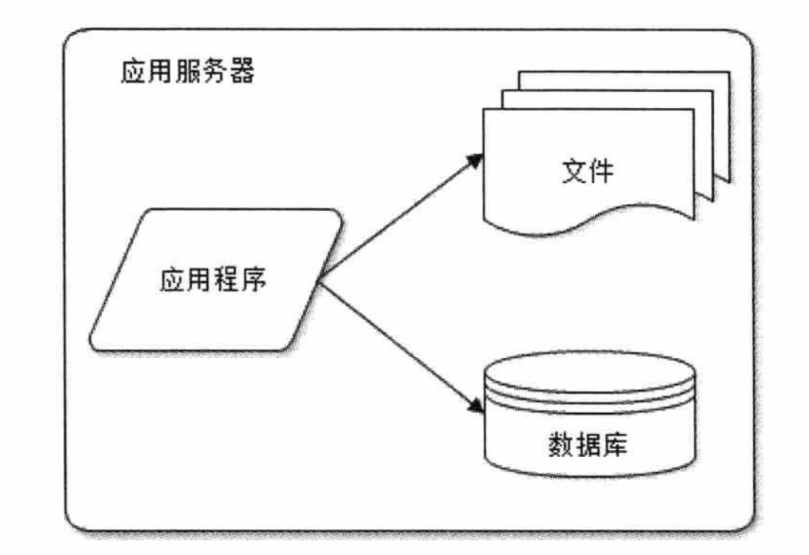
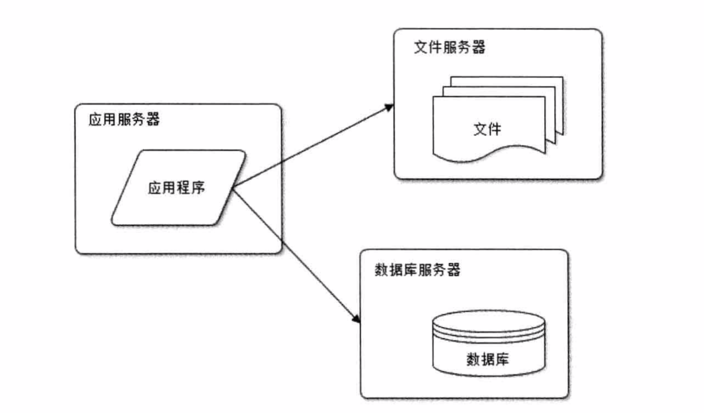
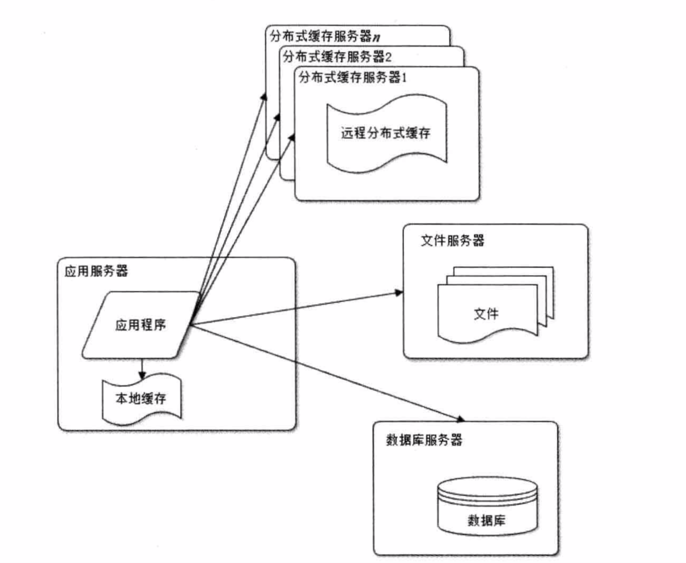
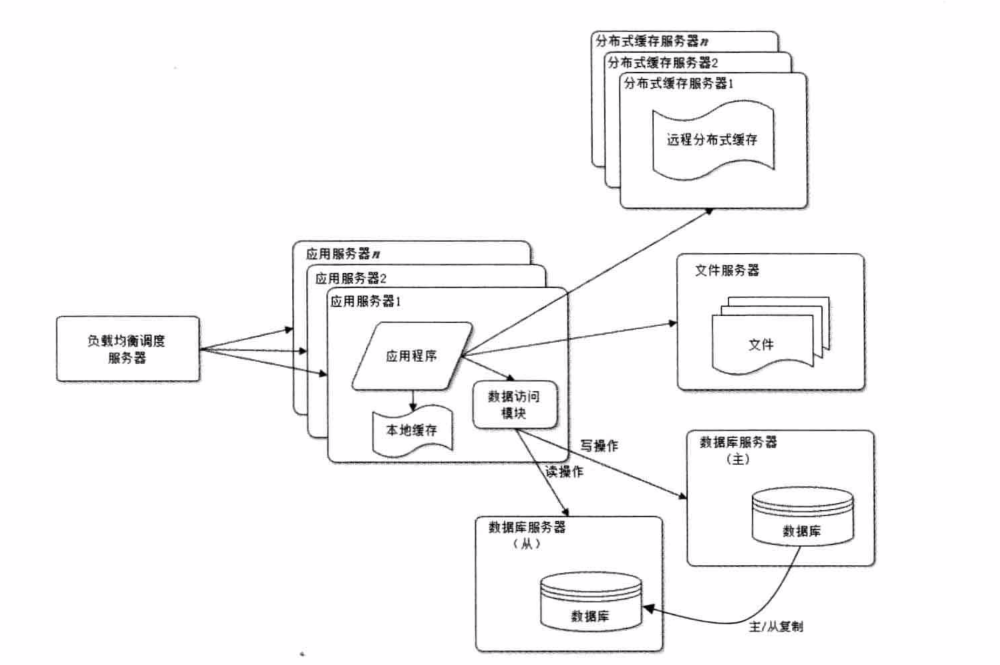
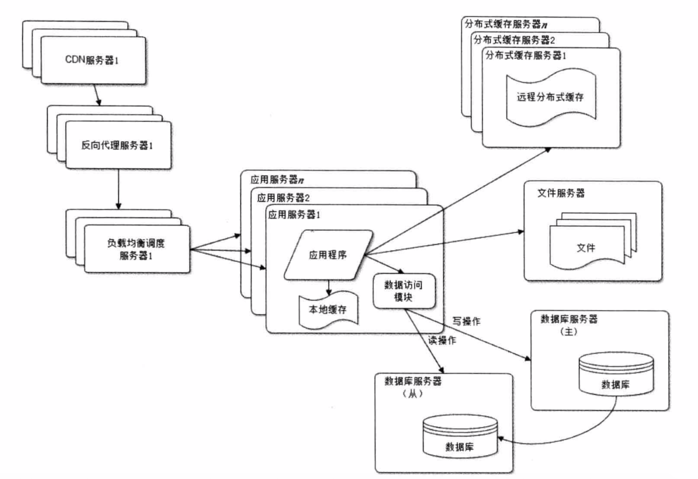
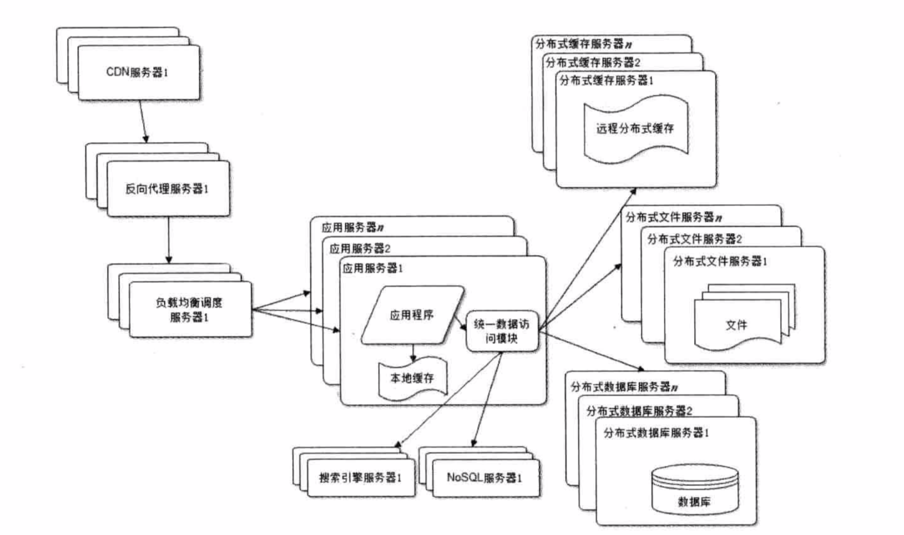
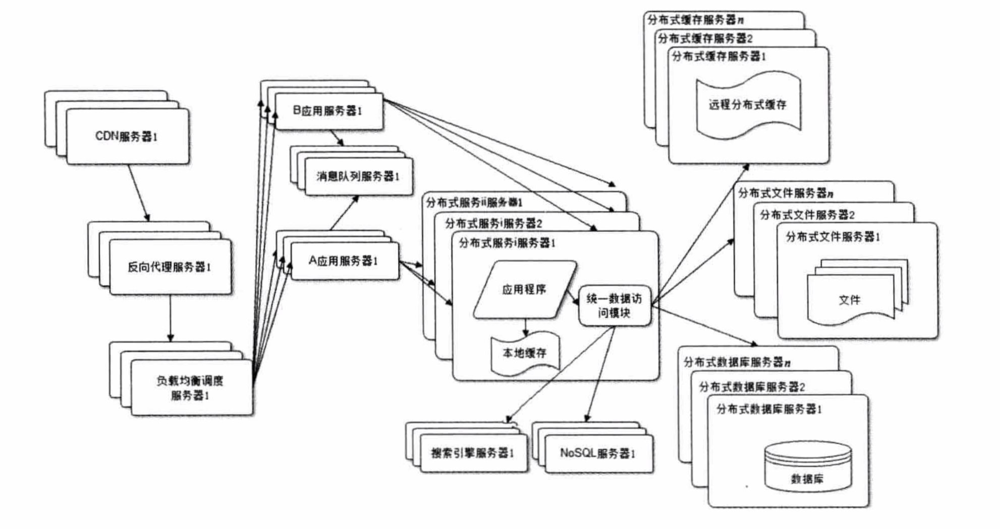

## 一 大型互联网系统的特点

一般互联网的系统是渐进发展的，初创互联网应用的规模很小，只要满足核心业务功能即可，随着需求和用户量的增加，其体系、架构都会慢慢发展壮大，组中称为一个软件怪兽。与传统企业应用相比，大型互联网系统架构的特点：
- 高并发：系统流量巨大，需要面对高并发访问场景
- 高可用：互联网系统一般需要提供7*24小时不间断的服务
- 海量数据：数据量庞大，需要大量服务器存储
- 网络环境差异大：互联网应用的用户一般分布广泛，不同地区网络情况不尽一致
- 迭代速度快：互联网产品为了生存，产品迭代与发布频率极高

## 二 架构的演进

#### 2.1 单机时代

初期的互联网应用，一台服务器就能足够胜任其访问需求与数据存储需求，此时的系统架构如图：  

  

此时应用程序、数据库、文件等所有资源都存放在一台服务器上。

#### 2.2 应用与数据分离

随着用户的增多，2.1中的单机架构会产生以下问题：
- 用户量增多导致性能变差
- 数据量只能多导致存储空间紧张

此时演变后的架构如图：  
  

系统使用了三台服务器：应用服务器、文件服务器、数据库服务器。因为三台服务器满足的功能不同，其配置也不尽相同，如应用服务器需要处理大量业务，需要告诉CPU，数据库服务器需要存储大量数据，需要更大的磁盘。

#### 2.3 热点数据问题解决：引入缓存

在2.2中服务器按职能进行划分在一定程度上缓解了单机架构的问题，但是有这样一个现实（二八定律）：
`80%的业务访问集中在20%的数据上`，比如搜索引擎中，热度词汇的搜索次数总是远大于普通词汇，比如社交系统中，数据发生变化较大的用户往往都是登录频繁的用户。  

此时可以将该部分热点数据缓存在内存中，以缓解数据库本身IO压力。  

缓存可以分为两种：
- 本地缓存：缓存直接位于应用服务器本地，速度很快，但是会受到应用服务器内存限制，容易与业务程序争夺内存
- 分布式缓存：缓存位于专门的远程分布式缓存服务器上，利用集群机制在理论上可以不受内存容量限制。

 

#### 2.4 请求连接数有限问题解决：集群

热点数据问题在2.3得到解决，但是单一应用服务器仍然面临着问题：支持的请求连接数有限。当系统进入访问高峰期，应用服务器称为系统瓶颈。  

我们很容易想到增加该应用服务器的内存、更换高性能CPU等，对于大规模互联网应用来说，增加单一硬件质量远远不能满足业务的增长需求。  

使用集群方式是解决高并发、海量数据问题的常用手段：  

通过负载均衡调度服务器，可以将来自用户的高并发请求分发到应用服务器集群中的任一台服务器上。

#### 2.5 数据库读写分离

当缓存过期，或者出现未命中时，仍然有一部分读操作和全部写操作会访问到数据库，数据库的IO是系统瓶颈的重要阻力之一。  

目前大部分的主流数据库都提供主从热备功能，通过配置两台数据库主从关系，可以将一台数据库服务器的数据更新同步到另一台服务器上，通过该方式可以实现数据库的读写分离，从而提升数据库的负载：  

#### 2.6 网络问题解决：CDN与反向代理

不同地区的网络访问速度也千差万别，解决该问题的主要手段是CDN与反向代理。  

CDN和反向代理的基本原理都是缓存，其目的都是今早返回数据给用户，以减轻服务器负载压力：
- CDN部署在网络提供商的机房，用户的请求可以从距离自己最近的机房获取数据
- 反向代理部署在系统的中心机房，用户请求先访问反向代理服务器，如果反向代理服务器缓存着对应资源，则直接返回

#### 2.7 分布式系统

虽然数据库部分通过2台服务器实现了读写分离，但是业务面临爆炸式增长时，仍然不能满足需求。同样，文件服务器也会面临着一样的数据存储压力。此时需要分布式数据库与分布式文件系统。  

分布式数据库是数据库拆分的最后手段，只有单表数据规模非常庞大时才使用，常规推荐的手段是业务分库，将不同的业务的数据部署在不同的物理服务器上。  

同时，如果系统对数据存储和检索的需求很复杂，也可以引入Nosql与非数据库查询技术如搜索引擎。  

#### 2.7 业务拆分与分布式服务

在大规模互联网应用中，往往有许多不同或者互相关联的业务场景，使用分而治之的手段对系统进行拆分，不同的子应用独立部署，应用之间通过消息队列、rpc等方式进行通信，可以有效缓解单一系统的压力。  

同样每一个应用系统都需要执行许多相同的操作，如用户管理，商品管理等，那么可将这些共用的业务提取出来，独立部署，由这些可复用的业务连接数据库，提供业务服务，而应用系统只需要管理用户界面，通过分布式服务调用共用业务完成具体操作：

架构演进到这里，基本上能够解决大部分技术难题。

#### 2.8 后记

系统架构的设计应该与自身的业务需求相融合，不能一味追随大公司的解决方案。  

同样，许多难点中，技术解决方式也并不一定是最优解，比如12306售票平台，如果不考虑买票场景，直接设计，势必会成为一个全天候都在秒杀的系统，而通过排队机制、整点售票改为分时段售票能够在很大程度上解决并发问题。  