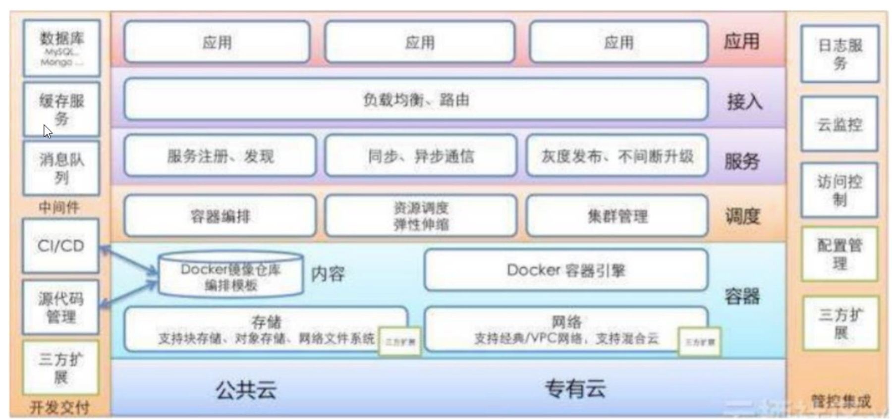

## 一 微服务生态

### 1.0 微服务生态的组成

微服务并不是单纯从开发的角度出发将业务进行微服务化，而是需要许多从硬件、网络到运维、测试的整体环境支持。虽然微服务与硬件、网络、构建和部署管道、服务发现和负载均衡都是分离的，但他们都是微服务生态系统基础设施组成部分。  

如何以一种稳定可靠、可伸缩、可容错的方式来构建、维护、标准化基础设施，才是微服务运维的根本。  

微服务生态需要下列四层支持：
- 第4层：微服务层。微服务常用业务开发框架
- 第3层：应用平台层。微服务的平台支持：服务管理平台、运维平台
- 第2层：通信层。涉及服务的通信，如TCP
- 第1层：硬件层。涉及服务的编排，如k8s 

在这些层级内、层级间存在着大量问题以及对应解决方案，如图所示：  
 

#### 1.1 第1层-硬件层

硬件层是微服务运行的基础，按照业务需求，可以是从云服务商提供，也可以是企业自己购置的服务器。  

微服务的硬件层生态主要有：
- 物理服务器
- 数据库系统
- 操作系统
- 资源隔离和抽象
- 配置管理
- 主机级别的监控
- 主机级别的日志

涉及的技术点有：  

 

#### 1.2 第2层-通信层

由于微服务之间的交互会在多个层上进行，所以通信是微服务重要的一环。该层主要生态包括：
- 网络传输：利用HTTP、TCP等进行通信
  - HTTP：RESTFUL
  - TCP RPC调用：Thrift、Dubbp、grpc
- 消息传递：即消息的序列化与反序列化，常用的有json、Thrift、protobuf（性能最高）
- 服务发现与注册：常用技术有Zookeeper、Etcd（CP系统）、Consul、Eureka（AP系统）
- 负载均衡：使用随机算法、轮询、一致性Hash等方式

**RPC、端点、消息传递**：  

微服务通过远程过程调用（RPC）或消息传递方式与其他微服务进行交互，其基本原理是：使用一个特定的协议，一个微服务把符合特定格式的数据通过网络发送到另一个服务或消息代理上。最常见的通信方式是HTTP+REST/Thrift，发送的数据一般是JSON/protocol buffer，不过由于其是同步阻塞的，有些厂商使用消息传递（异步非阻塞）的方式通信，其原理是一个微服务把数据通过网络发送给一个消息代理，消息代理会把消息路由到其他微服务上，消息穿很低可以使用直接请求/响应的方式，也可以使用发布/订阅的方式。值得一提的是Apache的Kafka支持上述两种消息模式。  

虽然消息传递带来的异步特性，但是它没有比REST更强的伸缩性，因为是集中式的，会导致消息对垒和消息代理变成整个生态系统的故障点，异步特性也会导致竞争条件。 

**服务发现与服务注册**：  

单体应用中，所有流量都发送给了负载均衡器，最后被分发到应用服务器上。在微服务架构中，业务流量被路由到不同的应用程序上，再被分发给部署了特定微服务的服务器。为了能够高效的实现上述场景，微服务架构需要在通信层实现：服务发现、服务注册、负载均衡。常见的服务发现技术有：etc、Consul、ZooKeeper。  

#### 1.3 应用平台层 

应用平台层包含了所有独立于微服务的内部工具和服务，其包含的主要内容有：
- 内部自助工具
- 开发环境
- 测试、构建、打包、发布公户
- 部署管道
- 微服务界别的日志与监控

#### 1.4 微服务层

该层属于业务范畴，与基础设施层完全分离。  

## 二 微服务架构全景图

