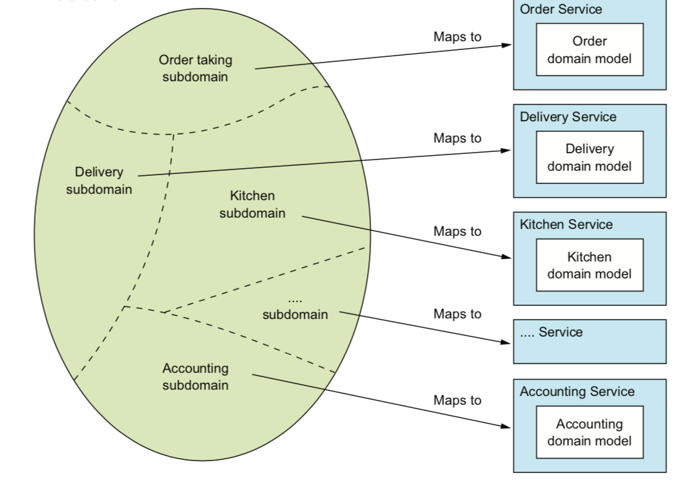

## 一 拆分策略

### 1.0 常见拆分策略

微服务需要对具体的业务进行服务化，拆分的服务之间尽量不要进行关联。开始服务化时，可以先进行粗粒度的划分，之后再慢慢根据业务的情况进行细粒度服务的切分，不必追求一步到位。  

在拆分前可以先做好解耦（每个单元可以独立变化，对外部依赖减少）：
- 去状态：有状态的服务进行伸缩极其复杂，可以将考虑将服务做到无状态，状态转移到分布式缓存、分布式数据库等地。由于数据库都是有状态的，这就实现了将状态抽象到了一个位置，便于集中管理。常见的需要拆分业务状态的服务有：
  - 定时任务：例如从A表把数据迁移到B表，如果两个服务中同时处理，没有中间协调器，会导致重复拉取，所以需要把定时任务从业务服务中提取出来，通过分布式调度任务统一处理
  - 本地存储：多个实例中，要么需要对本地存储全部同步，要么需要根据用户路由到同一个实例
  - 本地缓存：一些场景中，通过cookie、分布式缓存解决session问题
- 去触发器、存储过程：该功能在大型项目中难以扩展，也会导致复杂度增高，最好通过业务服务来实现

在细粒度拆分时常见的拆分策略有：
- 根据数据驱动（业务）拆分
- 根据领域驱动拆分

### 1.1 数据驱动拆分

比如在线商城根据业务能力，分为：订单管理、库存管理、发货等等。  

比如在线点餐系统分为：
- 供应商管理
  - Courier management：送餐员信息管理
  - Restaurant management：餐馆信息管理，如营业时间、餐厅地址等
- 消费者管理
- 订单管理
  - Order management：消费者创建、管理订单
  - Restaurant order management：餐馆管理订单的生产过程
  - Courier availability management：管理外卖员的实时状态
  - Delivery management：确认订单
- 账单管理
  - Consumer  accounting：消费者账单
  - Restaurant accounting：餐馆账单
  - Courier acctounting：外卖员账单

我们可以将上述子级业务映射到服务中，因为子级服务之间交叉关联性很小。但是账单管理则不同，三个子级分类之间相似性很大，所以账单管理可以整体映射为一个服务。  

围绕业务组织服务的好处是：较为稳定的业务能够使架构也变得相对稳定。  

### 1.2 领域驱动拆分

如图所示：  
  

领域驱动是一个自上而下的架构设计方法，通过和领域专家建立统一的语言，确定关键业务场景，逐步确定边界上下文。  

在与领域专家分析完业务模型后，定义领域模型的边界，确定调用关系，最后验证业务的流程！  

## 二 拆分指导原则

- 单一职责原则：设计小的、内聚的单一职责服务。你如客户获取外卖：订单创建、准备、送餐都由一个的那一刻服务承载
- 闭包原则：设计方向应该是一个变更只会影响一个服务

注意：**试图先从通过组件化再过渡的微服务架构的思路是绝对错误的！**，因为微服务强调业务的完整性，因此垂直划分优先，而组件化则强调抽象组件的共享。

## 三 微服务拆分的注意点

微服务拆分后，如果服务之间依赖关系复杂，循环调用多，那么升级会带来严重阻碍，所以需要注意：
- 基础服务层以及基础业务服务层主要做数据库的操作和一些简单的业务逻辑，不允许调用其他服务
- 组合服务层可以调用基础服务层完成复杂的业务逻辑，也可以调用组合服务层，但不允许循环调用
- 网络延迟：对服务的特定分解会导致各个服务之间的大量往返调用，可以通过批处理API进行聚合返回，也可以把多个服务组合在一起，用编程语言函数调用来代替进程间通信
- 同步进程间通信导致可用性降低：一般使用REST方式同步调用其他服务，一旦一个服务不可用，整个请求都会发生问题，这时候可以采用异步消息来消除同步调用产生的耦合问题
- 服务间维持数据一致性：比如某个服务发生数据变化，需要以原子方式同步更新多个服务数据，传统方式是使用两段提交的分布式事务管理机制。现在可以使用类似Saga的消息协作本地事务，因为其特性是最终一致的。
- 上帝类：上帝类是在整个应用程序中使用的全局类，大量的字段会映射到多个数据库表，比如电商系统的订单类！
  - 解决方案一：将Order类打包到苦衷并创建一个重点Order数据，处理订单的所有服务都使用此库访问数据库，该方案违反了微服务架构原则，对Order中心的任意更改都会影响到其他服务
  - 解决方案二：将Order数据库封装在OrderService中，该服务由其他服务调用以检索和更新，但是该方案造成OrderService称为一个纯数据服务，称为包含很少业务逻辑的贫血模型
  - 解决方案三：更好的方案是使用领域模型师合集将每个服务视为具有自己的领域模型的单独子域。

## 四 衡量微服务划分的合理性

下面是微服务划分后，其合理性的一些衡量标准：
- 一个功能的修改，是否能够达到交付周期以天为单位。如果需要几周、几月则意味着服务拆分粒度过大。
- 大多功能的修改是否可以在一个服务内完成。如果经常需要跨服务团队联合开发，则说明服务划分存在问题。
- 是否要频繁修改接口。排除接口本身设计不合理外，是否存在服务划分导致接口被频繁修改原因。
- 响应时间是否满足要求