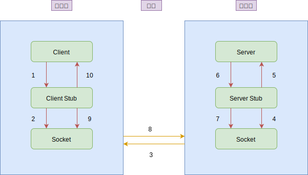
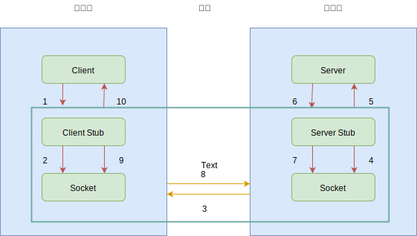

## 一 RPC执行过程

RPC：即Remote Procedure Call，远程过程调用，是常用的进程间通信方式，允许程序调用另外一个地址空间的过程/函数，无需开发者显式的书写远程调用细节。开发者在使用这些远程地址上的函数时，其调用方式和本地方式一致。  

完整的RPC包含四个核心组件：
- Client：服务调用方
- Server：服务提供方
- Client Stub：客户端存根，存放服务端的地址消息，再讲客户端的请求参数打包成网络消息，然后通过网络远程发送给服务方
- Server Stub：服务端存根，接受客户端消息，将消息解包，并调用本地方法

通信过程如图：  
  

通信过程总结如下：  
- 1 Client 客户端以本地调用方式调用服务（依赖服务接口）
- 2 Client Stub 客户端存根接收到调用请求后，负责将方法、参数等组装成能够进行网络传输的消息体（一般是将消息体对象序列化为二进制格式）
- 3 Client 客户端通过 Socket 将消息发送到服务器
- 4 Server Stub 服务端存根将收到的消息解码（反序列化）
- 5 Server Stub 服务端存根根据解码结构调用本地服务
- 6 本地服务执行后，将结果返回给服务端存根 Server Stub
- 7 Server Stub 服务端存根将返回结果打包为消息（序列化）
- 8 Server 服务端通过 Socket 将消息发送到客户端
- 9 Client Stub 客户端存根接收到返回消息后，进行解码（序列化）
- 10 Client 客户端得到最终结果

RPC的目标是简化上述操作的复杂性，为开发带来便利，所以RPC讲2，3，4，7，8，9步进行了封装，如图所示：    

  

## 二 RPC调用分类

### 2.1 分类概述

RPC调用主要分为两种：
- 同步调用：客户端调用服务端方法后，等待服务器，直到返回结果或超时，再执行自己的业务逻辑
- 异步调用：客户端调用服务端方法后，不等待服务器返回，直接继续自己的业务逻辑

### 2.1 雪崩应对

在分布式微服务架构中，一个业务的调用会往往会跨越两到多个服务进程，整个调用链路上的同步调用等待的瓶颈会由最慢的服务决定。如果存在A同步调用B，得到结果后同步调用C，这样的调用很容易产生雪崩效应，比如C服务宕机，则示例的业务将会直接等待超时，占用大量的资源。  

常用解决雪崩的方法有：
- 超时策略：设置较短的超时可以解决服务级联调用产生的阻塞问题。但是一个请求从发出到收到响应的时间是不确定的，在微服务架构中，需要根据成功调用一个服务调用链的平均时间来合理配置服务接口超时时间
- 熔断器机制：熔断器的模式使用断路器来检测故障是否已得到解决，防止请求反复尝试执行一个可能会失败的操作（超时时，rpc框架会依据业务执行重试、补偿策略），从而减少等待纠正故障的时间，该方案相对于超时策略更加灵活

### 2.2 异步调用场景

在微服务中，大部分调用都是同步调用，异步调用常用于上游服务不会实时关注下游服务的调用结果，如：异步调用记录日志。 

## 三 RPC框架性能

影响RPC框架性能的因素如下：
- 网络IO模型：在高并发状态下，阻塞式同步IO、非阻塞式同步IO、多路IO模型对RPC服务器影响很大
- 网络协议：RPC框架可选择的协议有HTTP协议、HTTP/2协议、TCP协议，显然HTTP协议需要对传输内容编码，相对于TCP的二进制编码协议，其开销更大
  - 贴士：目前没有采用UDP的RPC框架
- 消息封装格式：消息的封装格式是RPC框架性能的核心影响因素，所以大多的RPC框架都会设计消息封装格式。封装时要考虑：消息体大小、编码解码难度、解决半包粘包难度。比如Dubbo的消息体数据包括：Dubbo版本号、接口名称、接口版本、方法名、参数列表、参数、附加信息等
- Schema和序列化：指序列化和反序列化的时间，序列化后的数据字节大小也会直接影响RPC框架性能

## 四 RPC框架与分布式服务框架

RPC框架的通信方式是点对点的，即服务消费者与服务提供者是点对点通信的，点对点通信包括：通信、序列化、反序列化、协议等内容。  

分布式服务框架不仅仅包含RPC框架的特性，还包括：
- 负载均衡策略：对多台服务器的服务进行负载均衡
- 服务自动化注册、发布
- 服务治理

大规模应用服务化后，服务治理的问题会渐渐暴露出来，纯粹的RPC框架服务治理能力不健全，要解决这些问题，必须通过服务框架和服务治理来完成。  

## 五 常用RPC框架

常用RPC框架：
- go rpc：Golang原生提供的rpc通信框架，只支持go项目
- RMI：Remote Method Invocation，基于Java远程方法协议和Java的原生序列化实现的RPC框架
- Thrif：facebook出品的跨语言服务部署框架，采用二进制编码协议，传输协议使用TCP/IP，通过中间语言IDL来定义接口与数据类型，最后由一个编译器生成不同语言的代码
- gRPC：google出品的跨语言、跨平台的远程调用系统。
  - gRPC基于HTTP/2协议，HTTP/2协议特点：连接多路复用、双向流、服务器推送、请求优先级、首部压缩
  - gRPC支持ProtoBuf：ProtoBuf是google开发的数据序列化协议，性能高、表达能力强
  - gRPC支持多语言，能够给予语言自动生成客户端和服务端功能库

国内的RPC框架
- Dubbo：阿里开放的Java RPC框架
- Motan：新浪微博的RPC框架，底层支持Java
- RPCX：基于Go的服务治理的RPC框架，客户端支持跨语言
- Tars：腾讯的RPC框架
- BRPC：百度的RPC框架

市面上一些流行的服务治理系统：
- go-micro：golang著名的服务治理框架，内部支持 go rpc、grpc多种rpc框架
- Spring Cloud：Java生态的微服务集成框架