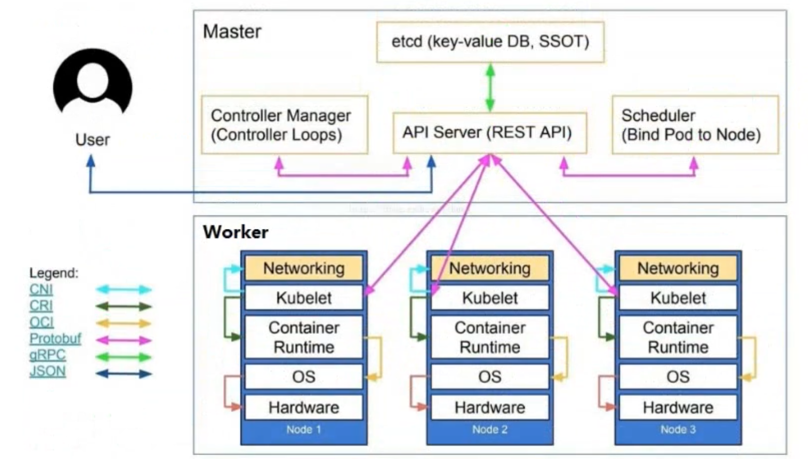

## 一 服务编排

> 服务编排：在实际开发中，业务可能需要被拆分成多个子任务，然后对这些子任务进行顺序组合，当子任务按照方案执行完毕后，就完成了业务目标，服务编排即对多个子任务执行顺序进行确定的过程

常见的服务编排工具：
- Mesos：apache开源的资源管理系统，用户为twitter（但是twitter在2019年宣布从Mesos迁移到了k8s）
- docker swarm：docker公司出品的服务编排工具套件，目前其功能很简陋，阿里云宣布不再支持docker swarm
- kubernetes：即大名鼎鼎的k8s，其目标是让容器化应用的部署更加简单、高效！

经过几年博弈，k8s已经是服务编排的事实标准！  

## 二 K8s简介

Kubernetes是Google在2014年发布的一个开源项目，简称k8s，即k与s之间有8个字母，起源于谷歌内部的Borg系统的Go语言实现。    

k8s是一个轻便、可扩展的开源平台，用于管理容器化的应用和服务。**通过k8s能够进行应用的自动化部署与扩容、缩容！**

k8s核心特性：轻量、开源、支持弹性伸缩、负载均衡，**超强的横向扩容能力,是其最强大、最实用的地方之一！**   

当前版本的K8S支持管理节点数为2000台，支持POD管理15万个！  

## 三 k8s架构简介

k8s在部署时是有中心节点的，如图所示：  

 

k8s包含两种节点：
- Master node：集群的管理节点，用于对工作节点进行调度管理，支持外部用户使用kubectl的命令操作k8s集群。包括组件有：
  - API Server：所有服务的统一访问入口
  - Scheduler：负责接收任务，选择合适的节点分配任务
  - Cluster State Store：etcd的数据库，存储k8s集群需要持久化的信息
  - Controller Manager Server：维持副本期望数目
  - kubelet：与容器引擎的交互工具
  - kube proxy：写入规则至IPTABLES/IPVS，以实现映射访问
- Worker node：集群的工作节点，用于运行业务应用的容器。包括组件有：
  - kubelet：同上
  - kube proxy：同上
  - Container Runtime：容器运行时环境

k8s节点的工作明细图：  

  

## 四 k8s集群的部署

k8s有多种搭建方式，但是由于国内网络原因，都存在网络困难问题：
- 单机方案：
  - minikube：k8s官方的单机集群快速部署工具，国内推荐使用阿里云版：https://github.com/AliyunContainerService/minikube
  - docker desktop：docker可视化客户端现在也支持k8s，由docker公司出品，国内也推荐使用阿里云版：https://github.com/AliyunContainerService/k8s-for-docker-desktop
- kubeadm：官方提供的生产环境集群版安装工具包，所有组件都在集群中运行，非常优雅，但是该工具正式推出时间不长！！！
- 二进制：纯手动源码安装，安装复杂。该方式最大的问题是，k8s的各个组件都是以独立进程方式运行，进程死亡后不方便维护。而kubeadm安装的k8s组件大多以容器方式运行，稳定性更好。  

## 五 k8s生态

k8s的生态中有很多插件：
- CoreDNS：为集群中SVC创建一个域名ip对应关系解析
- Dashboard：k8s的浏览器控制面板
- Ingress Controller：实现七层代理（k8s官方只支持四层代理）
- Fedetation：跨集群中心的多k8s统一管理软件
- Prometheus：k8s的监控平台
- ELK：k8s的集群日志平台