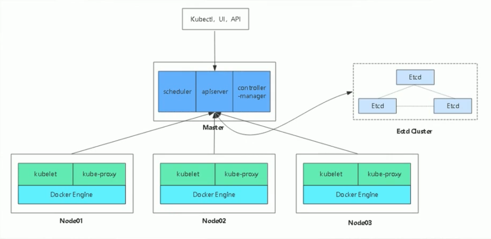

## 一 k8s简介

Docker容器为运维与开发带来了极大便利，但多个docker也同样引起了服务的调度困难。服务调度编排软件很多，比如：Kubernetes、Dorkcer Swarm。发展到今天Kubernetes已经是事实上的服务编排标准。  

Kubernetes是Google在2014年发布的一个开源项目，简称k8s，即k与s之间有8个字母。k8s可以整合多个正在运行的容器集群，用于对容器化应用程序进行自动部署、扩展、管理。  

k8s特性：
- 自动包装：根据资源需求、约束自动放置容器，同时不会牺牲可用性
- 横向缩放：可以依据用户命令、CPU负载情况调整应用程序副本数
- 自动部署和回滚：k8s会监控所有实例，若出现问题，则k8s会为用户恢复
- 存储鞭片：自动安装用户所选择的存储系统，无论是本地存储还是公有云提供的存储系统
- 自我修复：k8s会重新启动失效的容器
- 服务发现和负载均衡：k8s为容器提供了自己的IP地址和一组容器的单个DNS名称，实现了负载均衡

K8s是一个无侵入性的开放平台，现有系统能够很容易的迁移到k8s上，为企业提供了一个晚辈的分布式系统支撑平台。k8s提供的容器化架构，可以满足很多生产环境常见的需求：
- 多进程协同工作
- 存储系统挂载
- Distributing secrets
- 应用健康监测
- 应用实例赋值 
- Pod自动伸缩扩展
- Naming and dicovering
- 负载均衡
- 滚动更新
- 资源监控
- 日志访问
- 调用应用程序
- 认证和授权

k8s已经是容器领域中的事实标准。  

## 二 k8s基础架构

K8s的主要结构：
- Cluster：计算机资源的集合，k8s利用资源运行基于容器的应用
- Master：Cluster的大脑，负责管理、调度Node节点，即决定应用放在哪里运行，为了实现高可用，可以运行多个Master
- Node：负责运行容器应用、监控容器状态并汇报给Master
- Pod：k8s的最小工作单元，每个Pod包含一到多个容器，Pod中的容器会被作为一个整体被Master调度到一个Node上运行

k8s集群的架构：  

## 三  k8s的安装

### 2.0 安装简介

k8s有多种搭建方式，但是由于国内网络原因，都存在网络困难问题：
- 单机方案-minikube：k8s官方的单机集群快速部署工具，国内推荐使用阿里云版：https://github.com/AliyunContainerService/minikube
- 单机方案-docker desktop：docker可视化客户端现在也支持k8s，由docker公司出品，国内也推荐使用阿里云版：https://github.com/AliyunContainerService/k8s-for-docker-desktop
- 集群方案-kubeadm：官方提供的生产环境集群版安装工具包，所有组件都在集群中运行，非常优雅
- 集群方案-二进制：纯手动安装，安装复杂，但是利于学习与维护

笔者这里使用的是 docker desktop版作为学习使用！ 

