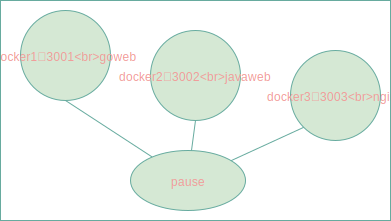
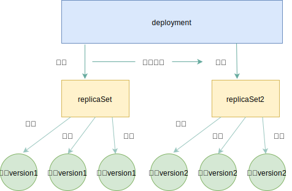
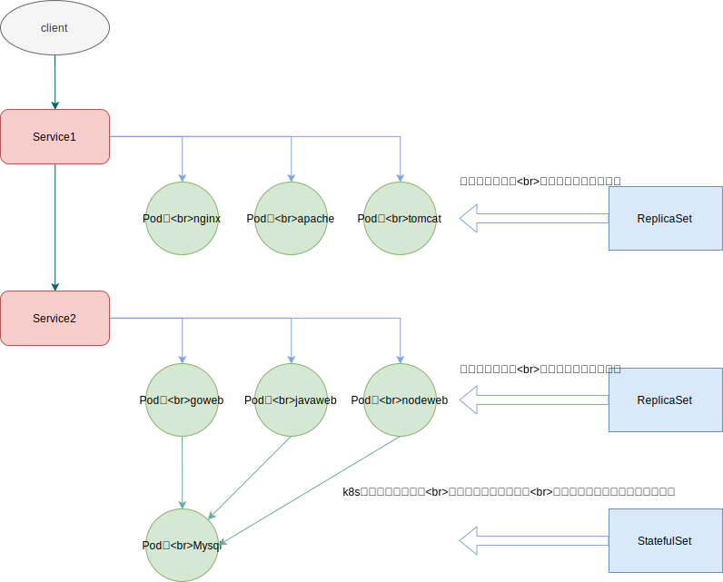
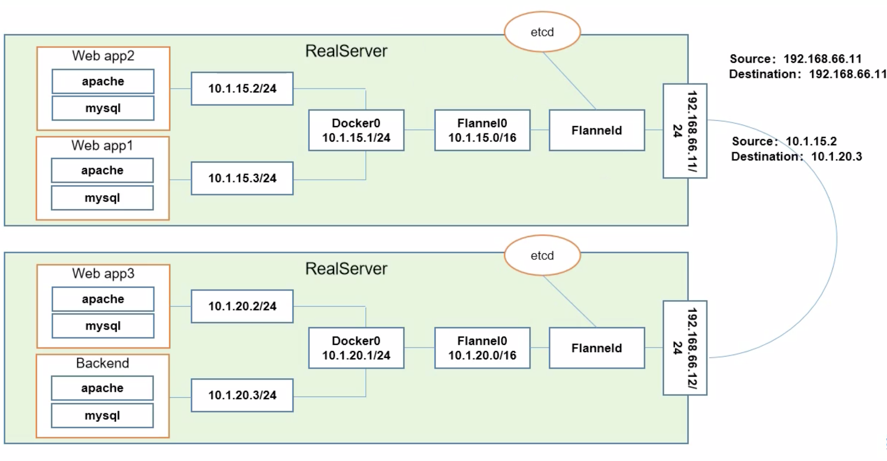
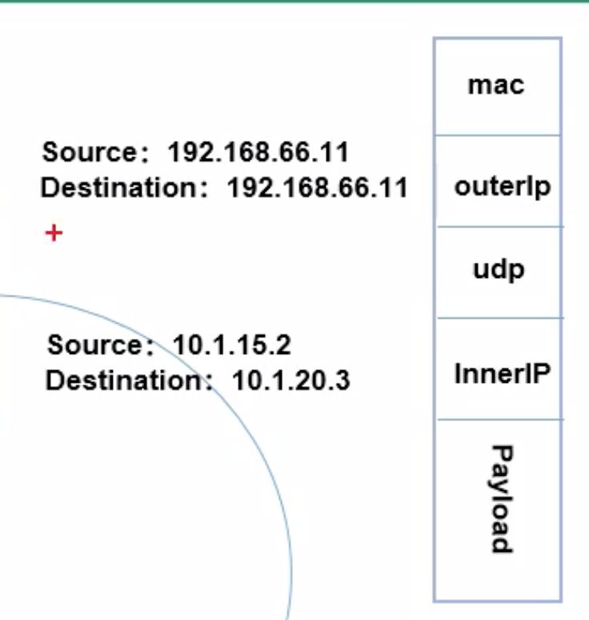

## 一 k8s基础结构

K8s的主要结构：
- Cluster：计算机资源的集合，k8s利用资源运行基于容器的应用
- Master：Cluster的大脑，负责管理、调度Node节点，即决定应用放在哪里运行，为了实现高可用，可以运行多个Master
- Node：也称为工作节点，拥有kubelet工具，负责运行容器应用、监控容器状态并汇报给Master。每个工作节点也需要容器的运行时，如docker
- Pod：k8s的最小工作单元，每个Pod包含一到多个容器，Pod中的容器会被作为一个整体被Master调度到一个Node上运行

一个 Kubernetes 工作集群至少有三个节点。 Master 管理集群，而 Node（节点）用于托管正在运行的应用程序。  

Kubernetes引入Pod主要基于下面两个目的：
- 可管理性：有些容器天生就是需要紧密联系，一起工作。Pod提供了比容器更高层次的抽象，将它们封装到一个部署单元中。
- 通信和资源共享： 
  - Pod中的所有容器使用同一个网络namespace，即相同的IP地址和Port空间，它们可以直接用localhost通信。
  - Pod中的所有容器共享存储，当Kubernetes挂载volume到Pod，本质上是将volume挂载到 Pod中的每一个容器。     

Pod如图所示：  
   

Pods有两种使用方式：
- 运行单一容器：one-container-per-Pod是Kubernetes最常见的模型，这种情况下，只是将单个容器简单封装成Pod。即便是只有
一个容器，Kubernetes管理的也是Pod而不是直接管理容器
- 运行多个容器：同一个Pod中的这些容器联系必须非常紧密，而且需要直接共享资源。
  - 比如Tomcat和Mysql只是通过JDBC交换数据，不是直接共享存储，放入各自的Pod合适
  - 比如两个容器，一个用于实现外部文件读取存入共享volume，一个用于从volume读取文件响应web请求，那么这2个容器紧密相连，适合在一个Pod

## 二 k8s架构

### 2.1  控制器 Controller

Kubernetes通常不会直接创建Pod，而是通过 Controller 来管理Pod，可以确保容器应用的副本数始终保持在用户定义的副本数。即如果有容器发生异常退出，会自动创建新的Pod来替代，退出的容器会被自动回收。  

Controller中定义了Pod的部署特性，比如有几个副本、在什么样的Node上运行等。为了满足不同的业务场景，Kubernetes提供了多种Controller，包括：
- Deployment：最常用的Controller，负责滚动更新，确保Pod按照期望的状态运行。
- ReplicaSet：用于实现Pod的多副本管理。使用Deployment时会自动创建ReplicaSet，也就是说Deployment是通过ReplicaSet来管理Pod的多个副本的，我们通常不需要直接使用ReplicaSet。
- StatefuleSet：Docker主要用于无状态服务，Deployments和ReplicaSets都是为无状态设计的。DStatefulSet可以解决有状态服务问题，用于保证Pod的每个副本在整个生命周期中名称是不变的，当某个Pod发生故障需要删除并重新启动时，Pod的名称会发生变化，同时StatefuleSet会保证副本按照固定的顺序启动、更新或者删除。
- DaemonSet：用于运行daemon，适合每个Node最多只运行一个Pod副本的场景，删除DaemonSet，也将会删除它创建的所有Pod
- Job：一次性任务。  
- Cronjob：定时任务

Deployment的滚动更新与ReplicaSet关系(还会支持回滚，因为图中的第一个RS在滚动更新时只是停用，不是被回收)，架构如图：  

  

服务状态：
- 无状态服务：没有对应的存储需要实时保留，或者脱离运行环境一段时间后回到运行环境仍然能够工作。常见的无状态服务有：Apache服务，负载均衡调度器
- 有状态服务：需要实时进行数据更新存储，抽离出集群后再回到环境无法正常工作。常见的有状态服务有：Mysql，MongoDB

StatefulSet应用场景：
- 稳定的持久化存储：Pod重新调度后还是能访问到相同的持久化数据，基于PVC实现
- 稳定的网络标志：Pod重新调度后，PodName和HostName不变，基于Headless Service实现（即不是由Cluster IP的Service实现）。 
- 有序部署、有序扩展：Pod是有序的，在部署和扩展时要依据定义的顺序依次进行（即从0到N-1，在下一个Pod运行之前，所有以前的Pod必须都是Running和Ready状态），基于init containers实现
- 有序收缩、有序删除：从N-1到0开始进行有序的收缩、删除

DaemonSet应用场景：
- 运行集群存储daemon，例如在每个Node上运行glusterd、ceph
- 在每个Node上运行日志手机daemon，如fluentd、logstash
- 在每个Node上运行监控daemon，如Prometheus

Cron Job管理基于时间的Job，即：
- 在给定时间点只运行一次
- 周期性的在给定时间点运行

### 2.2 服务 Service

当Deployment部署了多个个副本，每个Pod都有自己的IP后，就会形成一个完整的服务Service。  

客户端不能直接访问Pod，而是要通过 Service 访问这些副本，因为Pod很可能会被频繁地销毁和重启，它们的IP会发生变化，用IP来访问不太现实。  
  

Kubernetes Service定义了外界访问一组特定Pod的方式。Service有自己的IP和端口，Service为Pod提供了负载均衡。  

Kubernetes运行容器（Pod）与访问容器（Pod）这两项任务分别由Controller和Service执行。

### 2.3 命名空间 NameSpace

Namespace 是对一组资源和对象的抽象集合，比如可以用来将系统内部的对象划分为不同的项目组或用户组。  
 
如果有多个用户或项目组使用同一个Kubernetes Cluster，如何将他们创建的Controller、Pod等资源分开呢？ 答案就是Namespace。  

Namespace可以将一个物理的Cluster逻辑上划分成多个虚拟Cluster，每个Cluster就是一个Namespace。不同Namespace里的资源是完全隔离的。  

Kubernetes默认创建了两个Namespace：
- default：创建资源时如果不指定，将被放到这个Namespace中
- kube-system：Kubernetes自己创建的系统资源将放到这个Namespace中

## 三 k8s网络模型

k8s的网络模型假定所有Pod都在一个可以直接联通的扁平网络中，私有云在搭建k8s集群时，需要自己实现这个网络模型，将不同节点上的docke容器之间的访问打通，然后才能运行k8s。  

Flannel是CoreOS团队针对k8s设计的一个网络规划服务，其功能是让集群中的不同节点主机创建的Docker容器都具有全集群唯一的虚拟IP地址，并在这些IP地址之间建立一个覆盖网络（Overlay Network）。通过该覆盖网络，数据包就可以原封不动的传递到目标容器内。  

  

在上图中，app1、app2、app3都是不同的前端容器，Backend是后端容器，部署情况如图。容器与容器之间都是通过ip直接访问。app2访问app1是很容易的，他们在同一个网段内，但是如果app2访问app3或者Backend时，他们不在同一主机，要进行跨主机通信（不在同一个网段），如何进行通信？  

在主机上先安装Flanneld守护进程，该进程用于接收和转发数据报，并开启网桥Flannel0，专门用于接收Docker0转发出来的数据报文。  

app2访问Backend时，先到达docker0网关，docker0的钩子函数将数据包投递到Flannel0，从etcd中获取主机路由，Flanneld使用udp对数据报文进行封装，如图所示：  

  

到达目的主机后，倒序重复上述步骤就能达到目标容器！实现了跨主机的扁平化网络。  

Flannel启动后，会向ETCD中存储可分配的IP地址段资源，并监控etcd中每个Pod的实际地址，在内存中建立维护Pod的节点路由表。  

总结通信规则：
- 同一个Pod内的多个容器：共用pause网络栈，即共享同一个网路命名空间
- 不同Pod之间的通信：
  - 两个Pod在同一台主机：由Docker0网桥直接转发请求至Pod2
  - 两个Pod不在同一台主机：Overlay Network。利用etcd分布式存储讲Pod的IP和所在的Node的IP关联起来，通过这个关联让Pod互相访问
- Pod与外网之间的通信：查找路由表，转发数据包到宿主机网卡，宿主机网卡完成路由选择后，iptables执行Masquerade，把源IP更改为宿主网卡的IP，然后向外网服务器发送请求

