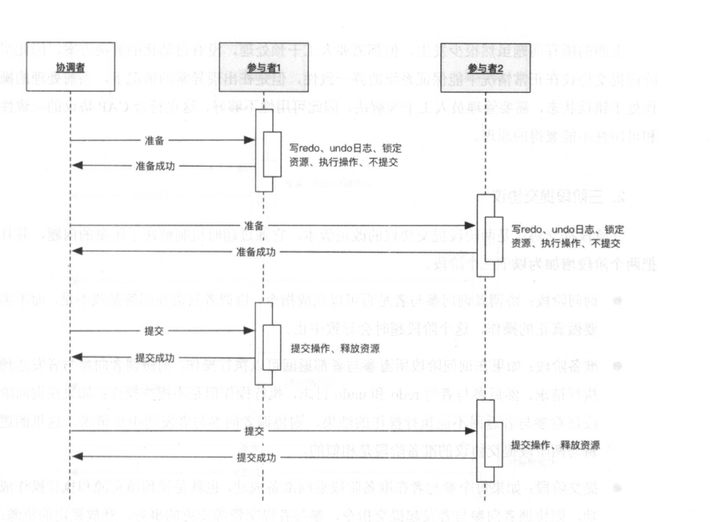
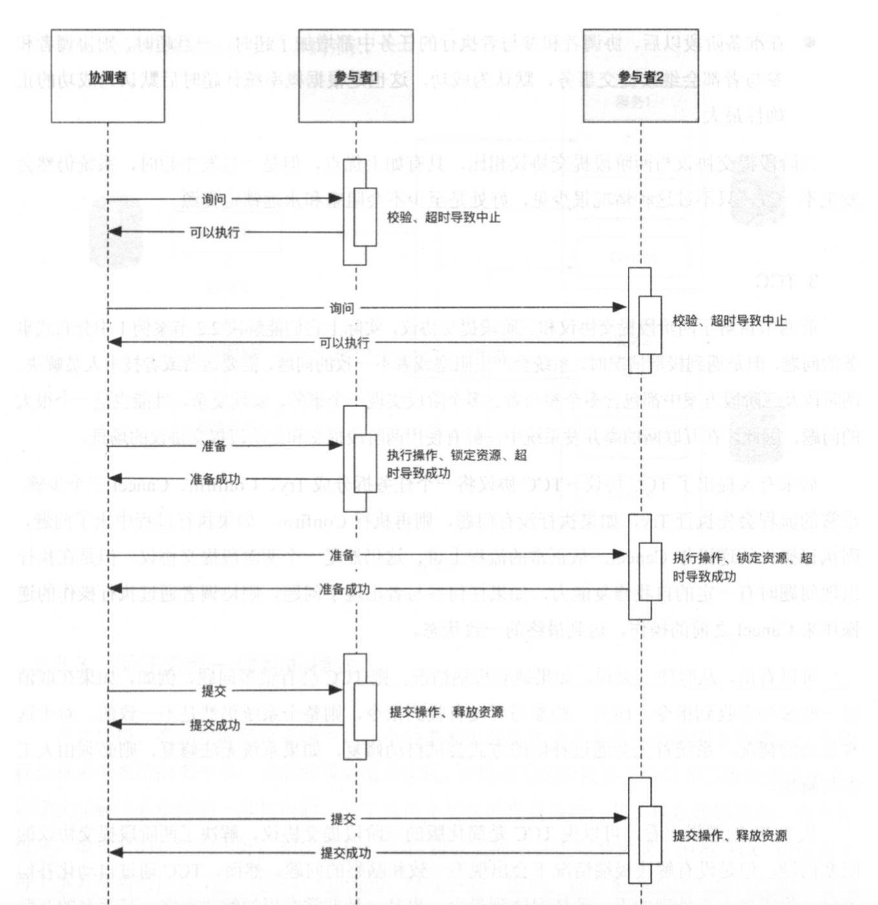

##  一 分布式一致性协议 

### 1.0 分布式事务处理模型

国际开放标准组织 Open Group 定义了 DTS (分布式事务处理模型〉 ，模型中包含 4 种角色: 
- 应用程序
- 事务管理器：统管全局的管理者
- 资源管理器：事务资源管理器
- 通信资源管理器：事务资源管理器

JavaEE规范也包含此分布式事务处理模型的规范，并在所有 AppServer 中进行实现。在 JavaEE 规范中定义了 TX 协议和 AX 协议， TX 协议定义应用程序与事务管理器之间的接口， XA 协议则定义事务管理器与资源管理器之间的接口。在过去使用 App Server 如 WebSphere 、WebLogic 、 JBo ss 等配置数据源时会看见类似 XAData source 的数据源，这就是实现了分布式事务处理模型的关系型数据库的数据源。在企业级开发 JEE 中，关系型数据库、 JMS 服务扮演资源管理器的角色 ， 而 EJB 容器扮演事务管理器的角色。

### 1.1 两阶段提交协议

两阶段提交协议把分布式事务分为两个阶段，均由事务管理器发起：
- 准备阶段：事务管理器向资源管理器发起指令，资源管理器评估自己的状态，如果资源管理器评估指 令可 以完成，则会写 redo 或者 undo 日在、(Write-Ahead Log 的一种)，然后锁定资源，执行操作，但是并不提交。
- 提交阶段：如果每个资源管理器明确返回准备成功，也就是预留资源和执行操作成功，则协 调者向资源管理器发起提交指令，资源管理器提交资源变更的事务，释放锁定的资源;如果任 何一个资源管理器明确返回准备失败， 也就是预留资源或者执行操作失败，则事务管理器向 参 与者发起中止指令，资源管理器取消己经变更的事务，执行 undo 日志，释放锁定的资源 。  

JAVA 的 XA 协议就是根据两阶段提交来保证事务的完整性，并实现分布式服务化的强一致性。 

两阶段提交如图所示（图中务管理器称为协调者 ，资源管理器称为参与者）：  
   

我们看到两阶段提交协议在准备阶段锁定资源，这是一个重量级的操作，能保证强一致性，但是有如下致命问题：
- 阻塞：任何一次指令都要明确收到响应，才会继续进行下一步，否则处于阻塞状态，占用的资源被一直锁定，不会被释放
- 单点故障：如果事务管理器岩机，资源管理器没有事务管理器指挥，则会一直阻塞，尽管可以通过选 举新的事务管理器替代原有事务管理器，但是如果事务管理器在发送一个提交指令后岩机，而提交 指令仅仅被 一个资源管理器接收，并且资源管理器接收后也岩机，则新上任的事务管理器无法处理 这种情况 。
- 脑裂：事务管理器发送提交指令，有的资源管理器接收到并执行了事务，有的资源管理器没有接收到 事务就没有执行事务，多个资源管理器之间是不一致的。

上面的所有问题虽然很少发生，但都需要人工干预处理，没有自动化的解决方案，因此两 阶段提交协议在正常情况下能保证系统的强一致性，但是在出现异常的情况下，当前处理的操 作处于错误状态，需要管理员人工干预解决 ， 因此可用性不够好，这也符合 CAP 协议的 一致性 和可用性不能兼得的原理。

### 1.2 三阶段提交协议

三阶段提交协议是两阶段提交协议的改进版本。它通过超时机制解决了阻塞的问题， 井且 把两个阶段增加为以下三个阶段：
- 询问阶段:事务管理器询问资源管理器是否可以完成指令，事务管理器只需要回答是或不是，而不 需 要做真正的操作 ，这个阶段超时会导致中止 。
- 准备阶段 : 如果在询问阶段所有资源管理器都返回可以执行操作，则事务管理器向资源管理器发送预 执行请求，然后资源管理器写 redo 和 undo 日志，执行操作但是不提交操作:如果在询问 阶 段任意资源管理器返回不能执行操作的结果，则事务管理器向资源管理器发送中止请求，这 里的逻 辑与两阶段提交协议的准备阶段是相似的。
- 提交阶段:如果每个资源管理器在准备阶段返回准备成功，也就是说预留资源和执行操作成 功，则事务管理器向资源管理器发起提交指令，资源管理器提交资源变更的事务，释放锁定的 资源: 如果任何资源管理器返回准备失败，也就是说预留资源或者执行操作失败，则事务管理器向 参 与者发起中止指令，资源管理器取消已经变更的事务，执行 undo 日志，释放锁定的 资源， 这里的逻辑与两阶段提交协议的提交阶段一致。  

如图所示：  
  

三阶段提交协议与两阶段提交协议主要有以下两个不同点：
- 增加了 一个询问阶段，询问阶段可以确保尽可能早地发现无法执行操作而需要中止的行 为，但是它并不能发现所有这种行为，只会减少这种情况的发生。
- 在准备阶段以后，事务管理器和资源管理器执行的任务中都增加了超时，一旦超时，则事务管理器和 资源管理器都会继续提交事务 ，默认为成功，这也是根据概率统计超时后默认为成功的正 确性最大。  

三阶段提交协议与两阶段提交协议相比，具有如上优点，但是一旦发生超时，系统仍然会 发生不 一 致，只不过这种情况很少见，好处是至少不会阻塞和永远锁定资源。

### 1.3 TTC协议

两阶段及三阶段方案中都包含多个资源管理器、多个阶段实现一个事务，实现复杂，性能也是一个很大 的问题，因此，在互联网的高并发系统中，鲜有使用两阶段提交和三阶段提交协议的场景。  

阿里巴巴的TCC 协议将 一个任务拆分成 Try、 Confirm、 Cancel 三个步骤 ， 正常的流程会先执行 T可，如果执行没有问题，则再执行 Confirm，如果执行过程中出 了问题， 则执行操作的逆操作 Cancel。 从正常的流程上讲，这仍然是一个两阶段提交协议，但是在执行 出现问题时有 一定的自我修复能力，如果任何资源管理器出现了问题，则事务管理器通过执行操作的逆 操作来 Cancel 之前的操作，达到最终的 一致状态。  

可以看出，从时序上来说，如果遇到极端情况，则 TCC 会有很多问题，例如，如果在取消 时一些资源管理器收到指令，而另 一些资源管理器没有收到指令，则整个系统仍然是不一致的 。对于这 种复杂的情况，系统首先会通过补偿的方式尝试自动修复，如果系统无法修复，则必须由人 工 参与解决 。  

从 TCC 的逻辑上看，可以说 TCC 是简化版的三阶段提交协议，解决了两阶段提交协议的 阻塞问题，但是没有解决极端情况下会出现不一致和脑裂的问题 。 然而， TCC 通过自动化补 偿 手段 ，将需要人工处理的不一致情况降到最少，也是一种非常有用的解决方案 。某著名 的互联 网公司在内部的一些中间件上实现了 TCC模式。  

我们给出 一个使用 TCC 的实际案例，在秒杀的场景中，用户发起下订单请求，应用层先 查 询库存，确认商品库存还有余量，则锁定库存，此时订单状态为待支付，然后指引用户去支付 ， 由于某种原因用户支付失败或者支付超时，则系统会自动将锁定的库存解锁以供其他用户秒 杀。  

TTC协议使用场景：  

 