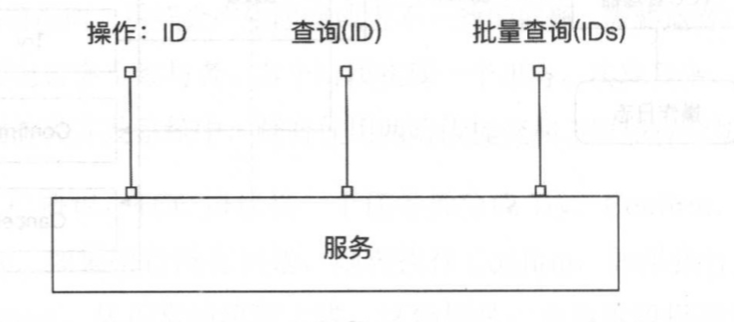
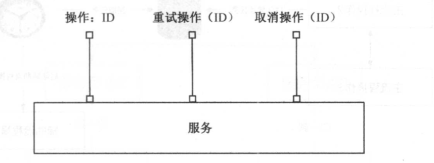
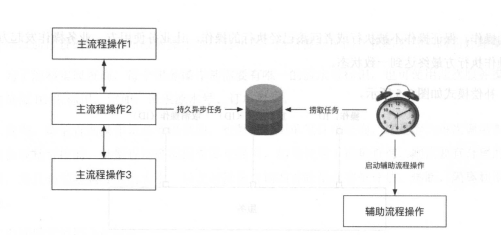
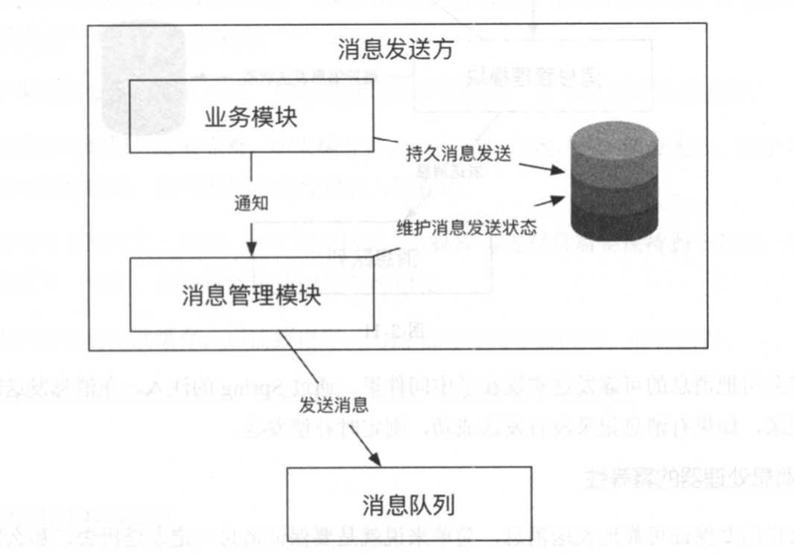
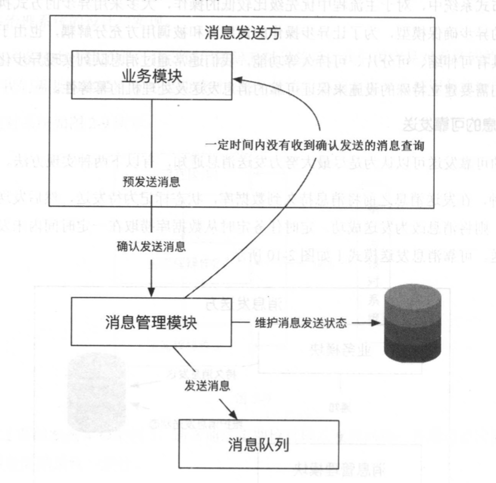

## 一 保证最终一致性

在大规模、 高井发服务化系统中， 一个功能被拆分成多个具有单一功能的子功能， 一个流 程会有多个系统的多个单一功能的服务组合实现，如果使用两阶段提交协议和三阶段提交协议， 则确实能解决系统间的一致性问题 。 除了这两个协议的自身问题，其实现也比较复杂、成本比 较高 ，最重要的是性能不好，相比来看， rec 协议更简单且更容易实现，但是 rec 协议由于 每个事务都需要执行 Try，再执行 Confirm， 略显雕肿，因此，现实系统的底线是仅仅需要达到 最终一致性，而不需要实现专业的、复杂的一致性协议。 实现最终一致性有一些非常有效、简 单的模式，下面就介绍这些模式及其应用场景 。  

### 1.1 查询模式  

任何服务操作都需要提供一个查询接口，用来向外部输出操作执行的状态 。 服务操作的使用方可以通过查询接口得知服务操作执行的状态，然后根据不同的状态来做不同的处理操作。  

为了能够实现查询，每个服务操作都需要有唯一的流水号标识，也可使用此次服务操作对 应的资源 ID 来标识，例如:请求流水号、订单号等 。  

首先，单笔查询操作是必须提供的，也鼓励使用单笔订单查询，这是因为每次调用 需要占 用的负载是可控的。批量查询则根据 需要来提供，如果使用了批量查询，则 需要有合理的分页 机制，并且必须限制分页的大小，以及对批量查询的吞吐量有容量评估、熔断、隔离和限流等措施。  

 

### 1.2 补偿模式 

有了上面的查询模式，在任何情况下，我们都能得知具体的操作所处的状态，如果整个操 作都处于不正常的状态，则我们需要修正操作中有问题的子操作，这可能需要重新执行未完成 的子操作，后者取消己经完成的子操作，通过修复使整个分布式系统达到 一致 。 为了让系统最 终达到 一致状态而做的努力都叫作补偿。  

对于服务化系统中同步调用的操作，若业务操作发起方还没有收到业务操作执行方的 明确 返回或者调用超时，则可参考案例 2，这时业务发起方需要及时地调用业务执行方来获得操作 执行的状态，这里使用在前面学习的查询模式 。 在获得业务操作执行方的状态后，如果业 务执 行方已经完成预设工作，则业务发起方向业务的使用方返回成功;如果业务操作执行方的 状态 为失败或者未知，则会立即告诉业务使用方失败，也叫作快速失败策略，然后调用业务操作的

  

补偿操作根据发起形式分为以下几种： 
- 自动恢复:程序根据发生不一致的环境，通过继续进行未完成的操作，或者回滚己经完成的操作，来自动达到 一致状态。
- 通知运营 :如果程序无法自动恢复 ，并且设计时考虑到了不 一致的场景 ，则可以提供运营功能，通过运营手工进行补偿。
- 技术运营:如果很不巧，系统无法自动回复，又没有运营功能 ，那么必须通过技术手段 来解决，技术手段包括进行数据库变更或者代码变更，这是最糟的 一种场景，也是我 们在生产 中尽量避免的场景 。

### 1.3 异步确保模式 

异步确保模式是补偿模式的 一个典型案例，经常应用到使用方对响应时间要求不太高的场 景中，通常把这类操作从主流程中摘除，通过异步的方式进行处理，处理后把结果通过通知系 统通知给使用方 。这个方案的最大好处是能够对高并发流量进行消峰，例如:电商系统中的物 流、配迭 ，以及支付系统中的计费、入账等。   

在实 践中将要执行的异步操作封装后持久入库，然后通过定时捞取未完成的任务进行补偿 操作来实 现异步确保模式，只要定时系统足够健壮，则任何任务最终都会被成功执行 。  

如图所示： 

  

### 1.4 定期校对模式  

系统在没有达到一致之前，系统间的状态是不一致的，甚至是混乱的， 需要通过补偿操作来达到最终一致性的目的，但是如何来发现需要补偿的操作呢?  

在操作主流程中的系统间执行校对操作，可以在事后异步地批量校对操作的状态，如果发现不一致的操作，则进行补偿，补偿操作与补偿模式中的补偿操作是一致的 。 

实现定期校对的一个关键就是分布式系统中需要有一个自始至终唯一的 ID， 生成全局唯一 ID有以下两种方法：
- 持久型 : 使用数据库表自增字段或者 Sequence 生成，为了提高效率，每个应用节 点可 以缓存一个批次的 ID，如果机器重启则可能会损失一部分 ID，但是这并不会产生任何 问题。
- 时间型:一般由机器号、业务号、时间、单节点内自增 D 组成，由于时间一般精确到秒或者毫秒，因此不需要持久就能保证在分布式系统中全局唯一 、粗略递增等 。

在实践中想在分布式系统中迅速定位问题时，可通过分布式系统的调用链跟踪系统进行，它能够跟踪一个请求的调用链。调用链是从二维的维度跟踪一个调用请求，最后形成一个调用树。  

全局的唯一流水 ID 可以将一个请求在分布式系统中的流转路径聚合 ，而调用链中的SpanID 可以将聚合的请求路径通过树形结构进行展示，让技术支持工作人员轻松地发现系 统出 现的问题 ， 能够快速定位出现问题的服务节点，提高应急效率 。笔者会在第 5 章 中介绍 基于调 用链的服务治理系统的设计与实现。  

在分布式系统中构建了唯一 ID、调用链等基础设施后，我们很容易对系统间的不一致进行 核对。 通常我们需要构建第三方的定期核对系统，从第三方的角度来监控服务执行的健康程度。  

定期校对模式多应用于金融系统中。金融系统由于涉及资金安全， 需要保证准确性， 所以需要多重的一致性保证机制，包括商户交易对账、系统间的一致性对账、现金对账、账务对账、 手续费对账等，这些都属于定期校对模式。  

通过定期核对模式可以保证系统间操作的一致性，避免因为掉单和状态不一致而导致出现问题，可实时止损 。

### 1.5 可靠消息模式

在分布式系统中，对于主流程中优先级 比较低的操作，大多采用异步的方式执行 ，也就是 前面提到的异步确保模型，为了让异步操作 的调用方和被调用方充 分解楠，也由于专业的消息 队列本身具有可伸缩、可分片、可持久等功能，我们通常通过消息队列实现异步化。对于消息 队列，我们需要建立特殊的设施来保证可靠的消息发送及 处理机的 幕等性。  

消息的可靠发送实现方式有两种。  

方式一：在发送消息之前将消息持久到数据库，状态标记为待发送， 然后发送消息，如果 发送成功，则将消息改为发送成功 。定时任务定时从数据库捞取在一定时间内未发送的消息并 将消息发送。如图：  
  

方式二：与方式一不同的是持久消息的数据库是独立的，不耦合在业务系统中。发送消息前，先发送一个预消息给某个第三方的消息管理器，消息管理器将其持久 到数据库，并标记状态为待发送 ，在发送成功后，标记消息为发送成功 。定 时任务定时从数据库中捞取一定时间内未发送的消息，查询业务系统是否要继续发送，根据查询结果来确定消息 的状态，如图：

  

消息处理器的幂等性：如果我们要保证可靠地发送消息，简单来说就是要保证消息 一定发送 出去，那么需要有重 试机制。有了重试机制后，消息就一定会重复，那么我们需要对重复的问题进行处理。处理重复问题的最佳方式是保证操作的幕等性，幕等性的数学公式为:`f(f(x))=f(x)`。  

保证操作的幂等性的方法有：
- 使用数据库表的唯一键进行滤重，拒绝重复的请求。
- 使用分布式表对请求进行滤重。
- 使用状态流转的方向性来滤重，通常使用数据库的行级锁来实现。
- 根据业务的特点，操作本身就是幕等的 ， 例如 : 删除 一个资源、增加一个资源、获得 一 个资源等。

### 1.6 缓存一致性模式

在大规模、高并发系统中的一个常见的核心需求就是亿级的读需求，显然，关系型数据库并不是解决高并发读需求的最佳方案，互联网 的经典做法就是使用缓存来抗住读流量。  

下面是使用缓存来保证一致性的最佳实践。
- 如果性能要求不是非常高，则尽量使用分布式缓存，而不要使用本地缓存。
- 写缓存时数据一定要完整， 如果缓存数据的一部分有效 ， 另一部分无效，则宁可在需要时回源数据库，也不要把部分数据放入缓存中。
- 使用缓存牺牲了 一致性，为了提高性能，数据库与缓存只需要保持弱一致性，而不需要保持强一致性，否则违背了使用缓存的初衷。
- 读的顺序是先读缓存，后读数据库，写的顺序要先写数据库，后写缓存。