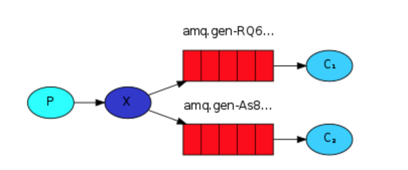
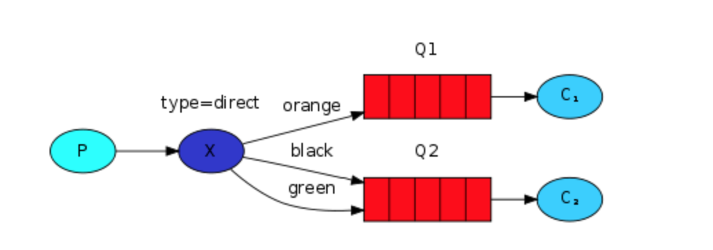

## 一 交换机总结

常用的Exchange类型有：fanout、direct、topic三种。  

fnout：扇出型。用以迟滞发布订阅模式，交换机把消息转发到所有与之绑定的队列中。  

  


direct：直接匹配型，用于支持路由模式，会对比路由键和绑定键，如果路由键和绑定键完全相同，则把消息转发到绑定键所对应的队列中。    

  

direct也可以实现多重绑定：

  


topic：模式匹配。  

   

RMQ会自带几个交换器，简单看下，这里只介绍AMQP default。当交换器名称为空时，表示使用默认交换器。空的意思是空字符串。默认交换器是一个特殊的交换器，他无需进行绑定操作，可以以直接匹配的形式直接把消息发送到任何队列中。  

## 二 消费端消息接收

### 2.1 推模式

RMQ Server主动把消息推给消费者：
```go
func (ch *Channel) Consume(queue, consumer string, autoAck, exclusive, noLocal, noWait bool, args Table) (<-chan Delivery, error)
```

- queue:队列名称。
- consumer:消费者标签，用于区分不同的消费者。
- autoAck:是否自动回复ACK，true为是，回复ACK表示高速服务器我收到消息了。建议为false，手动回复，这样可控性强。
- exclusive:设置是否排他，排他表示当前队列只能给一个消费者使用。
- noLocal:如果为true，表示生产者和消费者不能是同一个connect。
- nowait：是否非阻塞，true表示是。阻塞：表示创建交换器的请求发送后，阻塞等待RMQ Server返回信息。非阻塞：不会阻塞等待RMQ Server的返回信息，而RMQ Server也不会返回信息。（不推荐使用）
- args：一般为nil，用于一些自定义场景
注意下返回值：返回一个<- chan Delivery类型，遍历返回值，有消息则往下走， 没有则阻塞。

### 2.2 拉模式

消费者主动从RMQ Server拉消息：
```go
func (ch *Channel) Get(queue string, autoAck bool) (msg Delivery, ok bool, err error)
```


