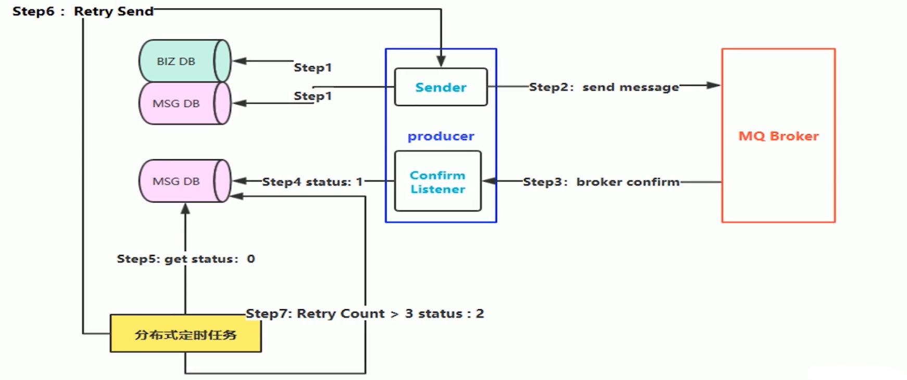

## 一 消息的可靠性

生产端的保证：
- 保证消息的成功发出，这样才能让消息成功进入Broker服务器
- 保证Broker节点能够成功接收消息
- 发送端收到MQ节点的确认应答
- 完善的消息补偿机制

## 二 生产端延迟投递

### 2.1 方案一：消息落库

在发送消息前先持久化，然后对消息状态进行状态标记。对出现异常的消息（持久化了，但是未发送）进行重新发送尝试

  

贴士：其实很多分布式的方案如二次提交、柔性提交并未在分布式系统中占据主要位置，大多采取的方案仍然是补偿方案。  

在图示中的step3，如果Broker收到消息在返回confirm时发生断网，就会出现生产者一直无法收到确认消息的问题，此处需要设计一个超时机制，发生超时的消息应该在生产端进入分布式定时任务轮询队列中（即重新out地Retry Send）。   

该方案缺陷：在高并发场景下性能很低
- 消息进行两次持久化I/O
- 消息的状态需要额外记录

### 2.2 方案二：延迟投递 即 confirm机制

对消息进行二次确认、回调检查，该方式适合互联网厂商的高并发场景，虽然也不能保证消息的100%投递成功，但是其减少了持久化操作！ 

Upstream即消息生产者，会先将订单入库（此时是直接一次性入库）。在Step1其实一次性生成了2条消息：
- first Send：真实的消息投递
- Second Send Delay Check：延迟多少分钟后发送该消息，用于确认

消费端在Step3需要监听消费队列，一旦发现消息处理完毕，会在Step4发送新的confirm消息，投递到MQ。  

在Step5，是一个全新的回调服务，会一直监听是否有confirm消息到来，如果有新消息到来，则会进行消息的持久化存储。该服务该会监听在Step2中延迟发送的一个check消息，并对其进行处理。  

callback服务就类似于一个补偿服务！  