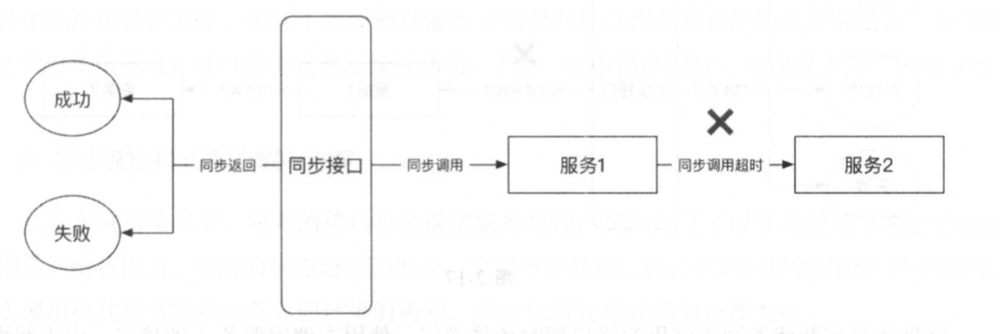
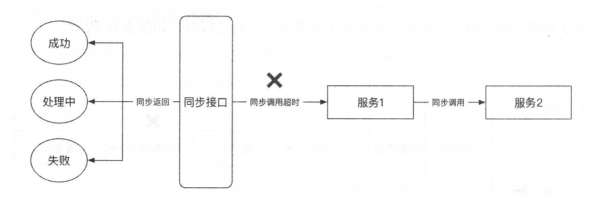
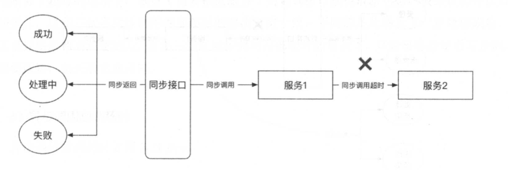
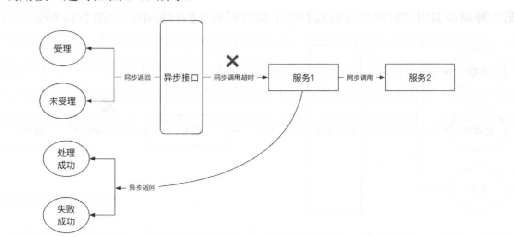
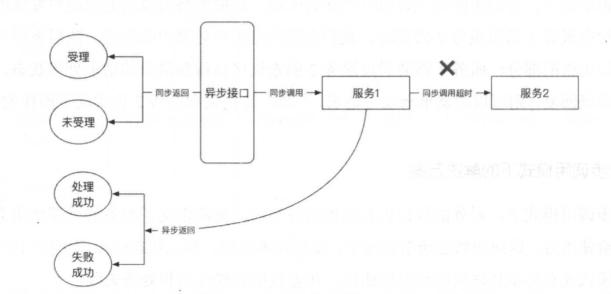
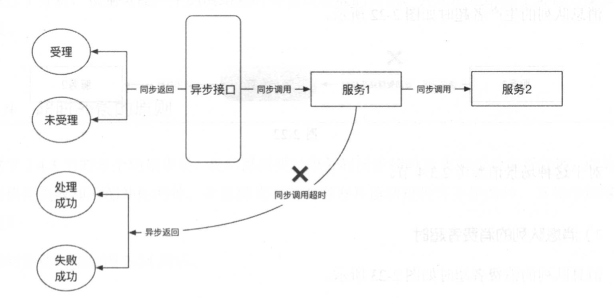

## 一 微服务的交互模式

由于网络通信不稳定，我们 在设计系统 时必须考虑到对网络通信的容错，特别是对调用超时问题的处理 。  

### 1.1 同步调用模式  

在同步调用模式中，服务 1 调用服务 2，服务 1 的线程阻塞等待服务 1 返回处理结果，如 果服务 2 一直不返回处理结果， 则服务 1 一 直等待到超时为止 。  

同步调用模式适用于大规模、高并发的短小操作，而不适用于后端负载较高的场景，例如:几乎所有 JDBC 的实现完全使用 BIO 同步阻塞模式 。  

### 1.2 接口异步调用模式  

在接口异步调用模式中 ，服务 1 请求服务 2 受理某项任务，服务 2 受理后即刻返回给服务 1 其受理结果 ，如果受理成功，则服务 1 继续做其他任务，而服务 2 异步地处理这项任务，直 到服务 2 处理完这项任务后，才反向地通知服务 1 任务已经完成，服务 1 再做后续处理 。  

接口异步调用模式适用于非核心链路上负载较高的处理环节，这个环节经常耗时较长，井对时效性要求不高。 例如:在 B2C 电商系统中，一件商品售卖成功后，需要给相应的商户入 账收入，这个过程对时效性要求不高 ，可以使用接口异步调用模式。

### 1.3 消息队到异步处理模式

消息队列异步处理模式利用消息队列作为通信机制，在这种交互模式中，通常服务 1 只需 将某种事件传递给服务 2，而不需要等待服务 2 返回结果。在这样的场景下，服务 1 与服务 2 可以充分解楠 ，并且在大规模、高并发的微服务系统中，消息队列对流量具有消峰的功能 。  

消息队列异步处理模式与接口异步调用模式类似 ，多应用于非核 心链路上负载较高的处理 环节中，井且服务的上游不关 心下游的处理结果，下游也不需要向上游返回处理结果 。 例如: 在电商系统中，用户下订单支付且交易 成功后，后续的物流处理适合使用消息队列异步处理模 式，因为物流发货属于物流和配送系统 的职责，不应该影响交易，所以交易系统不需要对其有 感知。  


## 二 同步调用模式-超时问题解决方案 

### 2.0 同步调用模式返回状态 

在同步调用模式下，对外的接口会提供服务契约，契约定义了服务的处理结果会通过返回 值返回给使用方，对返回的状态定义分为以下两种：
- 成功和失败
- 成功、失败、处理中

我们将第 1 种定义称为两状态的同步接口，将第 2 种定义称为三状态的同步接口。

### 2.1 两状态同步接口处理方式

对于两状态的同步接口，服务处理结果必须是成功的或者失败的，在这种情况下可能发生两种同步调用超时。  

第 1 种同步调用超时发生在使用方调用此同步接口的过程中：  
  


针对这个问题，我们需要服务的使用方使用上节中提到的查询模式，异步查询处理结果， 在获得 明确的处理结果后，得知处理结果是成功还是失败，然后做相应的处理。如果处理结果 为成功，那 么使用方可以继续下面的操作;如果结果为失败，那么调用方可以发起重试，请求 再次进行 处理 。然而，这里有 一个问题，如果查询模式的返回状态是未知请求，那么在这种情 况下使用方超时，服务 1 实际上没有接收到或者还没有接收到一开始的处理请求，服务使用方 需要使用同一个请求 ID 进行重试，服务 1 也必须实现请求处理的幕等性。  

第 2 种同步调用超时发生在内部服务 1 调用服务 2 的过程中，如图：  
 


在使用方调用服务 1，且服务 1 接收到请求后，同步调用服务 2，由于通信出现了问题， 所以服务 1 得到超时的结果。这时服务 1 应该怎么做呢?是重试、取消还是快速失败?

我们看到上图左面，服务 1 对外接口的契约中包含两个返回状态 : 成功或者失败，也 就是对于使用方来讲，不允许有中间的处理中的状态，对于这种服务内部超时的场景，必 须使 用快速失败的策略 : 针对这个超时错误，服务快速返回失败，同时在内部调用服务 2 的冲正接口，服务 2 的冲正接口可以判断之前是否接收到请求，如果接收到请求井做了处理，则 应该做 反向的回攘操作。如果服务 2 之前没有接收到处理请求，则忽略冲正请求，以此来实现服务的 幕等性。   


### 2.2 三状态同步接口

对于上面的第 2 种定义，服务契约中规定了 三种处理结果，状态值为:成功、失败和处理 中，对于超时等系统错误的请求，其实可以认为是处理中状态的一个特例，在这种场景的应用 里，超时被视为内部暂时的问题，随后可能被修复，因此，可能在一定的时间窗口内告知使用 方在处理中，随后修复问题井补偿执行，达到最大化请求处理成功的目标，不至于让使用 方重 试，以提升用户体验 。  

服务处理结果可能是成功或者失败，也可能是处理中，在这种情况下可能发生两种 同步调 用超时。第 1 种同步调用超时发生在使用方调用此同步接口的过程中，如图：  

 

这种场景和两状态同步调用的接口超时场景类似，使用方调用服务 l 的接口，由于网络等原因获得超时结果，这时适用房应该将超时看作处理中的一个特例，使用服务 l 的查询接口。后续补齐上一个请求 的处理状态，可参照两状态同步调用的接口超时场景的方案。  

第 2 种同步调用超时发生在内部服务 1调用服务 2 的过程中，如图：
  

在使用方调用服务 1， 且服务 1 接收到请求后，同步调用服务 2，由于通信出现了问题，所以服务 1 得到超时的结果，这时服务 1 又应该怎么做呢?  

这和两状态同步调用 的内部超时场景不 一样，两状态设计由于与使用方约定了契约，不是 成功就是失败，所以必须在同步调用时给予一个明确的结果，然而，在三状态同步调用的内部 超时场景下，可以返回给使用方一个中间状态，也就是处理中的结果，变相地把同步接口变成 异步接口 ，达到最终一致的效果。  

在这种场景下，我们更倾向 于给用户更好 的体验，尽最大努力成功处理用户发来的请求 。 因此，针对在服务 1 调用服务 2 时超时，我们会返回给用户处理中的状态，随后系统尽最大努 力补偿执行出错的部分，服务 1 需要通过服务 2 的查询接口得到最新的请求处理状态，如果服 务 2 没有明确回复， 则可以尝试重新发送请求，当然，这里需要服务 2 也实现了操作的幕等性 。  

## 三 异步调用模式-超时问题解决方案

### 3.1 异步接口调用超时

在异步调 用模式下，对外的接口也会提供服务契约，契约定义了服务的受理结果会通过返 回值返回给使用方，返回的状态通常为两个:受理和未受理。和三状态同步调用接口不同的是， 异步调用模式还有异步处理返回结果的通知，状态包括处理成功和处理失败 。
不同阶段 的网络通信产生的超时和处理方案如下 ：

异步接口调用超时，如图  

 

异步调用接口超时发生在使用方调用服务 1 的受理接口时，同两状态同步调用接口超时及三 状态同步调用接口超时的场景是一样的，需要通过查询来补齐状态，并根据状态来判断后续的操 作，具体的解决方案参考两状态同步调用接口超时和 三状态同步调用接口超时的解决方案。  

### 3.2 异步调用内部超时  

  

异步调用内部超时发生在服务 1 受理了使用方的请求后 ，服务 1 在处理请求时，在调用服 务 2 的过程中超时，这和 三状态同步调用内部超时的场景相似，由于异步调用模式使用的是受 理模式，所以一旦受理，我们便应该尽最大努力将用户请求的操作处理成功，因此，在服务 1调用服务 2 超时的场景下，服务 1 需要根据服务 2 的查询接口获得最新状态，根据状态补偿后 续的操作，这和三状态同步调用内部超时的解决方案一致，不同的是此场景下一旦处理成功， 则需要异步回调通知使用方，而在三状态同步调用内部超时的场景下，只需要等待使用方查询， 不 需要通知，也无法实现通知 。  

### 3.3 异步调用回调超时 

  

回调超时的问题在生产中经常出现 ，通常发生于这样的场景下 :服务 1 受理后成功地调用 了依赖服务 2，获得了明确的处理结果，但是在将处理结果通知使用方时出现超时。由于使用 方有可能是公司内部的也可能是外部的 ，网络环境复杂多变 ，发生超时的概率很大，因此，大多数公司都会开发一个通知子系统，用来专门处理回调通知。  

由于服务 1 通过回调通知使用方，所以服务 1 需要保证通知一定可送达，如果遇到超时 ， 则服务 1 负责重新继续补偿，通常会设计一个通知时间按一定间隔递增的策略，例如 :指数 回 退 ， 直 到通知成功为止，通知是否成功以对方的回写状态为准。  

## 四 消息队列异步处理模式的解决方案

消息队列异步处理模式多用于疏松祸合的项目，这些项目通常是在主流程中无法处理耗时的任务，恰好耗时的任务又不是核 心流程的 一部分，比如 : 电商平台的物流、配送等。 这类交互使用消息队列进行解辑，电商交易系统成功处理交易后，需要发送消息到消息队列服务器，后续的流程由物流平台处理，也不需要将处理结果反馈给交易平台。  

使用消息队列解精后，处理流程被分为两个阶段:生产者投递和消费者处理 ， 在不同阶段会产生不同的超时问题。  

消息队列生产者超时：  

  

消息队列消费者超时：  

   

对于消息队列的处理机与消息队列之间的超时或者网络问题，通常可以通过消息队列提供的机制来解决。一般消息队列会提供如下两种方式来消费消息：
- 自动增长消费的偏移量:在一个消费者从消息服务器中取走消息后，消息队列的消息偏移量自动增 加，即消息 一旦 被从消息队列中取走，则不再存在于服务器中，假如消息处理机对此消息 处理失败，则也无法从消息服务器中找回。
- 手工提交消费的偏移量 :在一个消费者从消息服务器中取走消息后，处理机先把消息 持久到本地数据库中，然后告诉消息服务器己经消费消息，消息服务器才会移除消息，如果在 没有告诉消息 服务器己经消费消息之前，持久失败或者发生了其他问题，则消息仍然存在于消 息服务器中 ，消息处理器下次还可以继续消费消息。

如果允许丢消息 ，则我们使用第 1 种处理方式，这种方式的并发量高、性能好，但是如果 我们对消息处理的准确性要求较高，则必须采用第 2种方式。

## 五 超时补偿原则 
原则1：
```
服务 1 调用服务 2，如果服务 2 响应服务 1 并且告诉服务 1 消息己接收，那么服务 1 的 任务就结束了;如果服务 2 处理失败，那么服务 2 应该负 责重试或者补偿 。在这种情 况下，服务 2 通常接收消息后先持久再告诉服务 1 接收成功，随后服务 2 才开始处理 持久的消息，避免服务进程被杀掉而导致消息丢失 。
```

原则2：
```
服务 1 调用服务 2，如果服务 2 没有给出明确的接收响应，例如网络超时，那么服务 1 应该持续进行重试，直到服务 2 明确表示己经接收消息 。 在这种情况下容易出现重复 的消息，因此在服务 2 中通常要保证滤重或者幕等性。
```