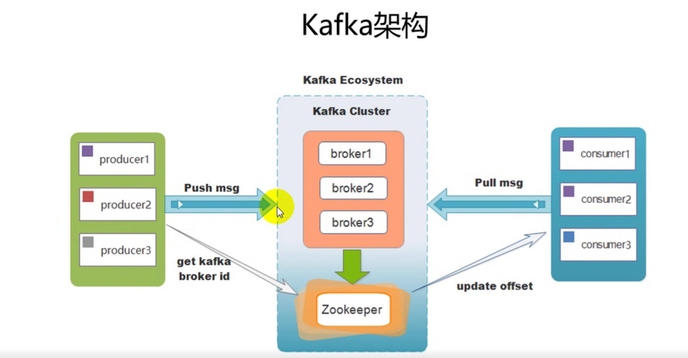
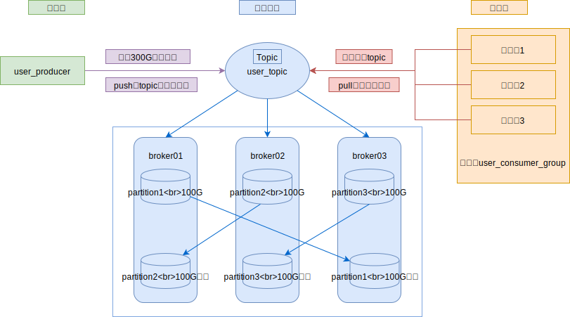
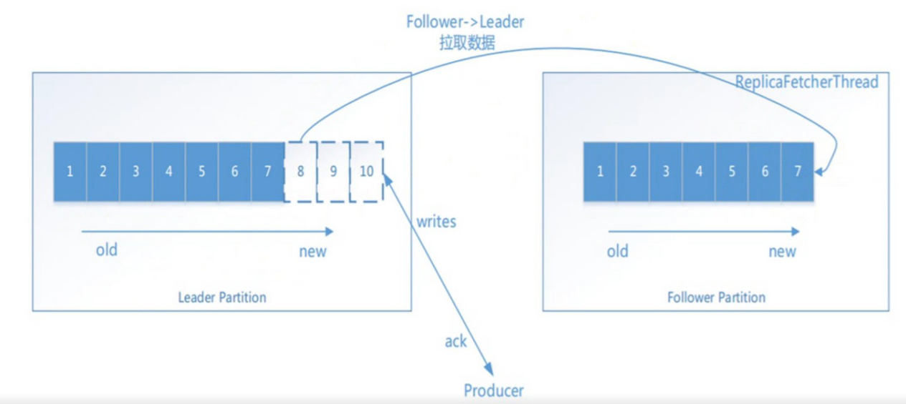

## 一 Kafka简介

Kafka是由Linkedin公司基于Scala语言开发的分布式消息系统，具备高吞吐特性，一般用于大数据场景中的日志系统中。  

目前Kafka支持多种客户端语言，包括：Java、Go、C++、NodeJS等。  

Kafka虽然是一个分布式消息中间件,但是并不符合JMS规范，即使消息已经被消费，也不会被马上删除，当消息保留一段时间后，会被批量删除，无论消息是否被消费过，该方式可以极大降低磁盘IO。 

Kafka的一些架构优点：
- 高性能：具备极高吞吐量，即使存储了许多TB的消息，也能发挥出稳定的性能，非常适合大数据场景。 
- 可靠性：支持分区，复制和容错
- 可扩展性：支持无停机的伸缩

## 二 Kafka架构

### 2.1 基础架构

Kafka架构图：  

  

Kafka架构中的重要组件：
- Broker：Kafka的服务端，负责接收、持久化数据。
- Producer：Kafka的生产端，负责生产数据发送到Broker。通常Producer是一个包含Kafka客户端的业务服务。
  - Producer具备异步发送能力，可以将多条消息缓存到客户端，然后批量发送给Broker。
  - Producer是直连Broker的，会和Tpoics下所有Partition Leader保持Socket连接
- Consumer：Kafka的消费端，负责从Broker订阅Topic，从订阅的Topic中 接收数据。通常Consumer是一个包含Kafka客户端的业务服务。

贴士：Topic即主题，类似数据库中表明，生产者和消费者之间通过Topic建立对应关系，每个Topic下对应多个Partition，所有的元数据保存在ZooKeeper中。  

Kafka的其他组件。
- Connector：允许构建和运行可重用的生产者或者消费者，能够把kafka主题连接到现有的应用程序或数据系统。例如：一个连接到关系数据库的连接器可能会获取每个表的变化。
- Stream：允许应用程序充当流处理器（stream processor），从一个或者多个主题获取输入流，并生产一个输出流到一个/多个主题，能够有效的变化输入流为输出流。  

一个典型的kafka集群中包含:
- 若干个Producer：生产者，使用push模式将消息发布到Broker
- 若干个Broker：Kafka集群服务器的实例
- 若干个Consumer：消费者，使用pull模式从Broker中订阅并消费消息
- 一个zookeeper集群：管理集群配置，选举leader，以及在Consumer Group发生变化时进行Rebalance（负载均 衡）； 

### 2.2 Kafka架构关系与分区

kafka的详细架构图：
  

图中的一些术语：
- Topic：每条发布到kafka集群的消息都有一个类别，这个类别就叫做Topic
- Partition：Partition是一个物理上的概念，每个Topic包含一个或者多个Partition
- Consumer Group：每一个消费者属于一个特定的消费组，该组里的消费者都订阅的是同一个Topic，但是是该Topic下的不同Partition。  

注意：每个Partition只能被一个消费者订阅，但是一个消费者可以订阅多个Partition，这样可以避免一定的重复消费。但是也降低了消费者的能力，可以通过增加Partition的方式实现扩展。  

详细架构图中，KafkaCluster包含三台服务器：broker1、broker2、broker3，生产端生产了300G数据，Kafka并不会直接存储这300G数据，而是在三台机器中分别存储部分数据：
- Broker1负责存储Partition1数据
- Broker2负责存储Partition2数据
- Broker3负责存储Partition3数据

数据分布式存储后，为了防止集群中服务器宕机引起的数据丢失,Kafka引入了副本机制，
如Broker1中的Partition1数据会保留副本到broker3。    

贴士：
- kafka将消息以topic为单位进行归类
- kafka主题始终是支持多用户订阅的；也就是说，一 个主题可以有零个，一个或者多个消费者订阅写入的数据。
- 生产者和消费者消费数据一般以主题为单位，更细粒度可以到分区级别
- **消费完消息后，消息不会被立即删除，会保留历史消息**。  

### 2.3 分区数 Partitions

> Partitions：分区数：控制topic将分片成多少个log，可以在配置中显式指定数量
> 一个broker服务下，也是可以创建多个分区，broker数与分区数没有关系

分区的编号从0开始，一个分区内的数据都是有序的，但是一个主题下如果有多个分区，那么其顺序就不能保证有序，如果要保证有序，一个主题下只能有一个分区！  

每个消费者隶属于某一个消费组，一个消费组可以有很多个消费线程。但是一个Topic中的一个分区只能同一时间被一个消费线程进行消费，所以2.3的详细架构图中，user_topic只有三个分区，同一时间只能被user_consumer_group中三个消费者线程消费，如果这时候要增加消费者数量，也需要同时提升user_topic内的分区数！！！  

所以：
- Partition数量决定了每个Consumer group中并发消费者的最大数量。
- 当生产速度很大，而消费速度不足时，可以调高分区数，以提高消费的并发量！  

### 2.4 副本数 replication-factor

副本数（replication-factor）：控制消息保存在几个broker（服务器）上，一般情况下等于broker的个数。  

一个broker服务下，不能创建多个主题，副本因子应该小于等于broker数。  

  

副本因子操作以分区为单位的。每个分区都有各自的主副本和从副本；主副本叫做leader，从副本叫做 follower（在有多个副本的情况下，kafka会为同一个分区下的分区，设定角色关系：一个leader和N个 follower），处于同步状态的副本叫做in-sync-replicas(ISR);follower通过拉的方式从leader同步数据。消费 者和生产者都是从leader读写数据，不与follower交互。  

如果某一个分区有三个副本因子，就算其中一个挂掉，那么只会剩下的两个钟，选择一个leader，但不会在其 他的broker中，另启动一个副本（因为在另一台启动的话，存在数据传递，只要在机器之间有数据传递，就 会长时间占用网络IO，kafka是一个高吞吐量的消息系统，这个情况不允许发生）所以不会在零个broker中启动。   

贴士：lsr表示当前可用的副本。  

### 2.5 Kafka Partition offset

任何发布到此partition的消息都会被直接追加到log文件的尾部，每条消息在文件中的位置称为offset（偏移量），offset是一个long类型数字，它唯一标识了一条消息，消费者通过（offset，partition，topic）跟踪记录。  