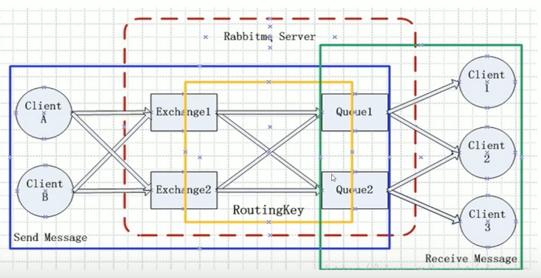
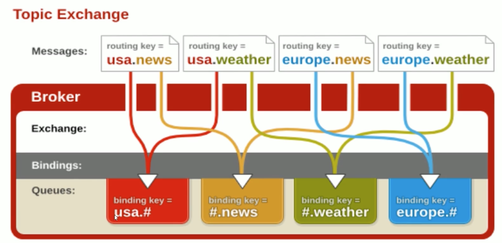

## 一 交换机

### 1.0 RabbitMQ的消息机制

RabbitMQ消息模式的核心内容是一个producter永远不会将消息直接发送给队列，Producter甚至都不知道其产生的消息会被分发到哪一个队列。  

producter只会将消息发送给exchange.Exchange，exchange类似一个中转站，将收到的消息发送给与之绑定的队列。

### 1.1 Exchange（交换机）概念

> Exchaneg：用于接收消息，并根据路由键转发消息到所绑定的队列

当Exchange接收到消息后，会依据交换机的类型（type），来判定该消息要进行哪种处理：是将消息发送到指定的一个队列，还是广播到所有队列，或者是直接将其忽略？ 

工作过程如图：  
  

交换机常用类型有：direct、topic、fanout、headers。  

在之前的简单模式、工作模式中，消息都被发送到了一个默认的exchange，此时参数为空字符串`ch.Publish("", ...`。  

### 2.2 direct类型

所有发送到Direct Exchange的消息被转发到RouteKey中指定的Queue。 
```go
	// 声明一个交换机
	err = ch.ExchangeDeclare("test_direct_exchange", "direct", false, false, false, false, nil)
	if err != nil {
		fmt.Println("channel exchangeDeclare err:", err)
		return
	}
	// 声明一个队列
	queue, err := ch.QueueDeclare("test_queue", false, false, false, false, nil)
	// 建立队列与交换机的绑定关系
	err = ch.QueueBind("test_queue", "", "test_direct_exchange", false, nil)
	if err != nil {
		fmt.Println("queueBind err:", err)
		return
	}
```

### 2.3 topic类型

topic类型的交换机会和RouteKey进行模糊匹配，对应的队列也必须绑定该topic交换机。  

模糊匹配的规则：
- ”#“：匹配一个或多个词，如 `log.#` 能匹配到 `log.info.oa`
- ”*“：匹配一个词，如 `log.*` 能匹配到 `log.erro`


  
注意：Direct模式下，可以使用RabbitMQ自带的Exchange：default Exchange，不需要额外进行任何绑定操作。  

### 2.4 fanout类型

该类型交换机不处理任何路由键，只需要将队列绑定到交换机即可，任何发送到该交换机的消息都会被转发到与该交换机绑定的所有队列上。  

由于没有匹配路由规则，fanout转发消息是最快的。 


### 2.5 交换机常用字段

交换机的常用字段：
- Name：交换机名称
- Type：交换机类型
- Durability：是否需要持久化
- Auto Delete：当最后一个绑定到Exchange上的队列删除后，自动删除该Exchange
- Internal：当前Exchange是佛用于RabbitMQ内部使用，默认为false
- Arguments：扩展参数，可以用于自定义扩展AMQP协议

## 三 Virtual host 虚拟主机

虚拟主机用于逻辑隔离，是最上层的消息路由，可以将虚拟主机理解为Redis的db0、db1、db9数据库。  

默认的RabbitMQ虚拟主机为 `/`，可以在web控制界面中添加新的虚拟主机（位于Admin-右侧Virtual Hosts，名称必须以 `/` 开头）。添加完虚拟主机后，需要点击该虚拟主机名称，进入详情页面，给用户进行授权，一个虚拟主机内部可以有若干个交换机和队列，但是他们的名字不能相同。  


## 四 Message消息

消息即服务器与应用程序之间传送的真实数据，由Properties和Payload（Body）组成，常用属性：
- delivery mode：
- headers：这里用于自定义属性
- priority：优先级，从0-9逐渐增大。但是由于是集群，这里的优先级设定比较复杂，需要设计顺序消息
- correlation_id：可以视为消息的唯一ID
- reply：消息失败了返回哪个队列
- expiration：消息过期时间